# 30 Guru Expert PP Passes — Cohort 4 (Unique from Cohorts 1, 2, 3)

## Relation to prior cohorts

**Cohort 1**: Protocol, directives, bash, paths, scripts/cursor, backup, Cursor commands, prompt, skill flow, superpowers, conciseness, docs, links, integration, cross-plan, markdown, task deps, verify, failure mode, progression, redundancy, Shopify, security, GitHub/MCP, edge cases, automation.

**Cohort 2**: Research, benchmark, gap analysis, cognitive load, stakeholder comms, code quality, archaeology, naming, dependencies, dead refs, Cursor power user, rules choreographer, GitHub ops/Actions, Cursor Cloud, task decomposition, parallelization, idempotency, checklist, time estimate, file hierarchy/naming, image assets, versioning, archive, risk, rollback, troubleshooting, accessibility, final polish.

**Cohort 3**: Observability, plan testing, performance, governance, error messages, onboarding, feedback loop, knowledge graph, conflict resolution, escalation, terminology, traceability, coupling, chaos testing, cost-benefit, prioritization, MVP, incremental delivery, token budget, multimodal, agent handoff, debugging, logging, release, plan QA, consolidation blueprint, worktree, AO store, discoverability, continuity.

**Cohort 4** (this plan): Schema validation, MCP interop, brand/IP, scenario testing, personas, migration path, dry-run, permissions, notifications, doc-as-code, version migration, rollback verification, A/B variants, capacity, disaster recovery, telemetry, plugin architecture, dependency injection, industry standards, security posture, performance baseline, tech debt prevention, inclusive design, localization, API contracts, state machine, sustainability, change impact, regression prevention, final sign-off.

---

## Plan iterations (progression)

| Iteration | Source                   | Key changes                                                                           |
| --------- | ------------------------ | ------------------------------------------------------------------------------------- |
| V0        | Initial CreatePlan       | 7 steps, Context, Files, Verification, Backup                                         |
| V1        | PP-perfection            | Directive parsing, task tree, per-step verify/failure, resilience, recursive learning |
| V2        | Current plan             | 6 steps, COMMAND format, prompt structure, verification gate                          |
| V3        | Cohort 1                 | TBD                                                                                   |
| V4        | Cohort 2                 | TBD                                                                                   |
| V5        | Cohort 3                 | TBD                                                                                   |
| V6        | Cohort 4 (this run)      | TBD                                                                                   |
| **V7**    | **Master consolidation** | **Single plan merging all four cohorts**                                              |

---

## 30 unique guru expert passes — Cohort 4 (no overlap with 1, 2, or 3)

### Phase S: Schema, interop, and compliance (Passes 91–95)

| #   | Expert                                             | Primary focus                    | Unique improvements                                                                                                                             |
| --- | -------------------------------------------------- | -------------------------------- | ----------------------------------------------------------------------------------------------------------------------------------------------- |
| 91  | **Schema and Format Validation Expert**            | Plan structure conformity        | Define plan schema (frontmatter, sections); validate against schema; add validation step to verification                                        |
| 92  | **MCP and Extensions Interoperability Specialist** | Cursor MCP, extensions           | How plan interacts with MCP servers; superpowers as extension; no MCP conflicts; document extension dependencies                                |
| 93  | **Brand and Tone of Voice Aligner**                | AO brand in prompt               | Ensure AO_AGENT_PP_PROMPT matches AO voice; aodrop.com tone; no generic AI phrasing                                                             |
| 94  | **Legal and IP Compliance Auditor**                | Teardown verified, no IP leakage | Confirm ProdigyClaw/OpenClaw teardown complete (see PRODIGYCLAW_TEARDOWN_COMPLETE.md); no proprietary material in plan or prompt; clean handoff |
| 95  | **Scenario-Based Execution Path Tester**           | "User X does Y" flows            | Define scenarios: "New user, first -pp"; "Plugin updated, restore needed"; add scenario matrix to plan                                          |

### Phase T: Migration and validation (Passes 96–100)

| #   | Expert                                            | Primary focus              | Unique improvements                                                                                   |
| --- | ------------------------------------------------- | -------------------------- | ----------------------------------------------------------------------------------------------------- |
| 96  | **Persona and Use-Case Mapping Specialist**       | Different user types       | Map: Developer, Operator, New contributor; "If you are X, start at Step Y"; persona-specific guidance |
| 97  | **Migration Path from Current State Designer**    | Now to completion          | Explicit "Current state" vs "Target state"; migration steps; what changes when; before/after snapshot |
| 98  | **Dry-Run and Preview Mode Specialist**           | Non-destructive validation | Steps that can run without side effects; "Dry-run: …" for each step; preview before apply             |
| 99  | **Permission and Execution Context Analyst**      | Who runs, from where       | Agent permission; user permission; workspace root; admin/elevated needs; document execution context   |
| 100 | **Completion Notification and Alerting Designer** | When plan done             | What signals completion; CONSOLIDATION_LOG as signal; optional: notify user; "Plan complete" criteria |

### Phase U: Documentation and versioning (Passes 101–105)

| #   | Expert                                          | Primary focus                  | Unique improvements                                                                           |
| --- | ----------------------------------------------- | ------------------------------ | --------------------------------------------------------------------------------------------- |
| 101 | **Documentation-as-Code Practitioner**          | Plan as SSOT                   | Plan is authoritative; no duplicate prose elsewhere; link to plan, don't copy; single source  |
| 102 | **Version Migration and Upgrade Path Designer** | Future V6 to V7                | How to evolve plan; upgrade path when Cursor/superpowers change; backward compatibility notes |
| 103 | **Rollback Verification Tester**                | Actually test undo             | For each undo step: verify it works; "Tested: restore from backup recovers"; add verification |
| 104 | **A/B and Variant Testing Specialist**          | Alternative approaches         | Document alternatives: COMMAND vs convention-only; session-start enhancement; pros/cons       |
| 105 | **Capacity and Concurrency Analyst**            | Multiple agents, parallel runs | Can two agents run plan? Lock/coordination? Plugin cache single-writer? Document concurrency  |

### Phase V: Resilience and telemetry (Passes 106–110)

| #   | Expert                                                   | Primary focus         | Unique improvements                                                                                          |
| --- | -------------------------------------------------------- | --------------------- | ------------------------------------------------------------------------------------------------------------ |
| 106 | **Disaster Recovery and Backup Verification Specialist** | Backup actually works | Verify backup file restores correctly; test restore flow; checksum or integrity check                        |
| 107 | **Telemetry and Analytics Design Expert**                | What to measure       | Metrics: steps completed, failures, duration; where to store; privacy; add Telemetry section                 |
| 108 | **Plugin Architecture and Extensibility Reviewer**       | Plan extensibility    | Can plan be extended (e.g. add -pp variants)? Hook points; plugin-friendly design                            |
| 109 | **Dependency Injection and Modularity Specialist**       | Swap components       | Prompts, scripts, COMMAND as replaceable; document interfaces; support swapping prodigy-protocol for variant |
| 110 | **Industry Standard Alignment Analyst**                  | DevOps, ITIL, etc.    | Align with change management, release process; industry terms where helpful; document alignment              |

### Phase W: Quality and sustainability (Passes 111–115)

| #   | Expert                                               | Primary focus            | Unique improvements                                                                                  |
| --- | ---------------------------------------------------- | ------------------------ | ---------------------------------------------------------------------------------------------------- |
| 111 | **Security Posture Reviewer**                        | Beyond secrets           | Permissions, isolation, least privilege; plugin cache writable by whom; add Security considerations  |
| 112 | **Performance Baseline and Benchmarking Specialist** | Establish metrics        | Baseline: plan execution time; step durations; "Typical run: N minutes"; add Performance note        |
| 113 | **Tech Debt Prevention Analyst**                     | Plan doesn't create debt | Ensure plan doesn't introduce shortcuts, TODOs, or future rework; clean, sustainable outcome         |
| 114 | **Inclusive Design and Diversity Reviewer**          | Beyond accessibility     | Multiple skill levels; varied environments; non-English future; inclusive language; broaden audience |
| 115 | **Localization and i18n Readiness Specialist**       | Future non-English       | Structure for translation; no hardcoded strings in critical paths; document i18n readiness           |

### Phase X: Formal models and longevity (Passes 116–120)

| #   | Expert                                                   | Primary focus          | Unique improvements                                                                                      |
| --- | -------------------------------------------------------- | ---------------------- | -------------------------------------------------------------------------------------------------------- |
| 116 | **API and Contract Design for Steps Expert**             | Step interfaces        | Input/output contract per step; "Step N accepts X, produces Y"; formal interface definition              |
| 117 | **State Machine and Execution Flow Modeler**             | Formal execution model | States: Not started, Step 1…6, Verified, Failed; transitions; state diagram optional                     |
| 118 | **Sustainability and Long-Term Viability Analyst**       | 1-year, 5-year view    | Will plan still work in 1 year? Plugin API stability? Cursor evolution? Add Sustainability note          |
| 119 | **Change Impact and Regression Prevention Specialist**   | Impact of plan changes | When plan is edited: what breaks? Regression checklist; impact analysis template                         |
| 120 | **Final Sign-Off and Execution Readiness Gate Designer** | Ready for execution    | Pre-execution gate: all 120 passes satisfied? Sign-off checklist; "Plan approved for execution" criteria |

---

## Execution architecture (Cohort 4)

```mermaid
flowchart TD
    subgraph pre [Prerequisite]
        PRE[Apply Cohorts 1 2 3 perfected plan as baseline]
    end
    subgraph phaseS [Phase S: Passes 91-95]
        S1[Schema]
        S2[MCP Interop]
        S3[Brand]
        S4[Legal IP]
        S5[Scenario Testing]
    end
    subgraph phaseT [Phase T: Passes 96-100]
        T1[Persona]
        T2[Migration Path]
        T3[Dry-Run]
        T4[Permissions]
        T5[Completion Notification]
    end
    subgraph phaseU [Phase U: Passes 101-105]
        U1[Doc-as-Code]
        U2[Version Migration]
        U3[Rollback Verify]
        U4[A/B Variants]
        U5[Capacity]
    end
    subgraph phaseV [Phase V: Passes 106-110]
        V1[Disaster Recovery]
        V2[Telemetry]
        V3[Plugin Architecture]
        V4[Dependency Injection]
        V5[Industry Standards]
    end
    subgraph phaseW [Phase W: Passes 111-115]
        W1[Security Posture]
        W2[Performance Baseline]
        W3[Tech Debt]
        W4[Inclusive Design]
        W5[i18n]
    end
    subgraph phaseX [Phase X: Passes 116-120]
        X1[API Contracts]
        X2[State Machine]
        X3[Sustainability]
        X4[Change Impact]
        X5[Final Sign-Off]
    end
    PRE --> phaseS --> phaseT --> phaseU --> phaseV --> phaseW --> phaseX
    phaseX --> MERGE[Merge Cohort 4 findings]
    MERGE --> CONSOLIDATE[Master consolidation: merge Cohorts 1+2+3+4]
    CONSOLIDATE --> MASTER[Singular master plan V7]
```

---

## Master consolidation (post-Cohort 4)

After all four cohorts complete:

1. **Merge**: Apply findings from 120 passes (Cohorts 1–4) into [ao_agent_pp_prompt_conversion.plan.md](ao_agent_pp_prompt_conversion.plan.md).
2. **Conflict resolution**: Use Pass 69 (Cohort 3) and Pass 86 (Cohort 3) plus Pass 119 (Cohort 4) for change impact.
3. **Sign-off**: Pass 120 (Final Sign-Off) gates execution.
4. **Output**: Single master plan V7; archive cohort meta-plans; CHANGELOG and consolidation log.
