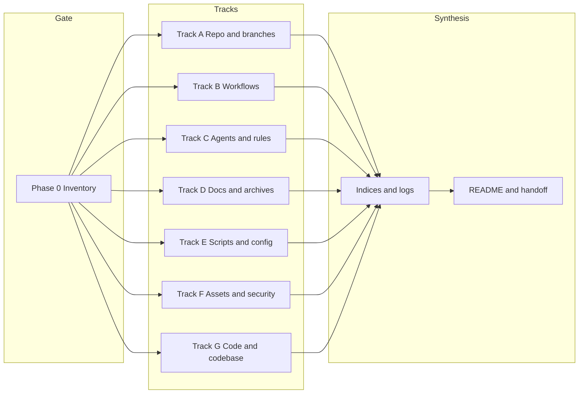

## Current Operating Mode (Read This First)

- **Phase 0 is signed off.** Do **not** re-run Phase 0 or Tracks A–G. Run **incremental fix batches only**: one batch → verify → log.
- **Hybrid Shopify model**: GitHub is used for history/CI and optional Shopify GitHub App deployment. Local scripts + browser approval workflow is always valid (especially when theme pull is blocked on this machine).
- **Worktree rule**: Run from primary repo path; if in a worktree, read from primary per [docs/status/IF_HANDOFF_FILES_MISSING_READ_FROM_PRIMARY.md](docs/status/IF_HANDOFF_FILES_MISSING_READ_FROM_PRIMARY.md).
- **No new artifacts**: Default is to update only [docs/status/CONSOLIDATION_LOG.md](docs/status/CONSOLIDATION_LOG.md) for tracking. Do not create new trackers or progress docs unless explicitly requested.
- **Binding rules**: [docs/status/EXECUTIVE_DECISION_WORK_PRINCIPLES.md](docs/status/EXECUTIVE_DECISION_WORK_PRINCIPLES.md). **Navigation**: [.cursor/plans/README.md](.cursor/plans/README.md) → this file.

---

# Final Repository Organization and Audit Plan

**Purpose**: Single canonical plan for repo organization and audit. The content below (Phase 0, Tracks A–G, Synthesis, Addendum, Guru pass 2) is **historical reference — already executed**. See [docs/status/CONSOLIDATION_LOG.md](docs/status/CONSOLIDATION_LOG.md) for what was done and when.

**Gate**: Phase 0 is signed off. Sign-off: **"Phase 0 finalized; proceeding allowed."** in [docs/status/PHASE_0_FINALIZATION.md](docs/status/PHASE_0_FINALIZATION.md). Do not re-run Phase 0 or tracks.

**Reference (already implemented)**: Pipeline and preview-before-apply: [docs/AGENT_WORKFLOW_CURSOR_SHOPIFY.md](docs/AGENT_WORKFLOW_CURSOR_SHOPIFY.md). Security: browser-first, no headless Shopify admin; [.cursor/rules/use-user-browser.mdc](.cursor/rules/use-user-browser.mdc), [.cursor/rules/shopify-preview-approval.mdc](.cursor/rules/shopify-preview-approval.mdc), [docs/security/00_security_checklist.md](docs/security/00_security_checklist.md).

**Entry — fix everything / full dominion**: Read [docs/status/HANDOFF_FOR_NEW_AGENT_202602.md](docs/status/HANDOFF_FOR_NEW_AGENT_202602.md) and [docs/status/EXECUTIVE_DECISION_WORK_PRINCIPLES.md](docs/status/EXECUTIVE_DECISION_WORK_PRINCIPLES.md); then run **incremental fix list** only (see below), verify, and append CONSOLIDATION_LOG.

### Incremental Fix List (project-wide)

Only outcome-based, small items:

- Stale plan refs: ensure no doc links to missing plan files (e.g. `full_project_update_perfection_guru.plan.md`); point to [.cursor/plans/README.md](.cursor/plans/README.md) and this plan.
- Lint/script: ESLint 9 flat config (no `--ext` in lint scripts); Shopify REST API version consistency where applicable.
- Inventories: BRANCH_INVENTORY worktree table matches WORKTREE_INVENTORY (include uub if present).

### No new artifacts

Default: only update CONSOLIDATION_LOG for tracking. Do not create new trackers or progress docs unless explicitly requested.

**How to build**: Open this file in Cursor and use **Build**. This is the only plan file in `.cursor/plans/`; historical track content is below.

---

## Historical reference (already executed)

Phase 0, Tracks A–G, Synthesis, Addendum, and Guru pass 2 below were executed per [docs/status/CONSOLIDATION_LOG.md](docs/status/CONSOLIDATION_LOG.md). Do not re-run; use the **Incremental Fix List** above for ongoing work.

---

## Plan setup (checklist)

| Item            | Status | Notes                                                                                 |
| --------------- | ------ | ------------------------------------------------------------------------------------- |
| Frontmatter     | Done   | name, overview, todos (11), isProject                                                 |
| Todos           | Done   | phase0 → track-a…track-g → synthesis → addendum → guru-pass-2                         |
| Inventory       | Done   | Repository file inventory table (docs 141, status 77, ~476 total)                     |
| Key files table | Done   | Phase 0, CONSOLIDATION_LOG, handoff, PHASE_0_FINALIZATION                             |
| Execution order | Done   | Phase 0 → Tracks A–G → Synthesis → Addendum → Guru pass 2                             |
| Entry           | Done   | HANDOFF_FOR_NEW_AGENT_202602 + PROMPT_FOR_NEW_AGENT; full dominion → Phase 0 optional |

**To run**: Open this file in Cursor and use **Build**, or execute the 11 todos in order.

---

## Repository file inventory (guru-corrected)

**Total on disk** (excluding .git and node_modules): **~476 files.** **Tracked** (excluding gitignored generated): **~431 files.**

| Area         | Count   | Notes                                                                                                                                                    |
| ------------ | ------- | -------------------------------------------------------------------------------------------------------------------------------------------------------- |
| Root         | 22      | index.html, styles.css, package.json, eslint, vitest, playwright configs, README, OPERATOR_RUNBOOK, AGENTS, LICENSE, replacements.txt, etc.              |
| .cursor/     | 16      | context (3: github, shopify, node-and-automation), plans (this file only), rules (5), tasks.json, settings.json, worktrees.json, extensions.json         |
| .github/     | 13      | ISSUE_TEMPLATE (3), PULL_REQUEST_TEMPLATE, settings.optimization, workflows (8)                                                                          |
| archive/     | 47      | 2026-01-30: expert-analyses-legacy (11), status-legacy (8), + reports; ARCHIVE_LOG                                                                       |
| assets/      | 19      | brand (8), drop01 (11: artwork, exports, mockups, spec-pack 5)                                                                                           |
| config/      | 4       | git-hooks/pre-commit, github-auth.md, shopify/.shopify-cli.yml, README                                                                                   |
| data/        | 6       | products, manufacturers, samples (.gitkeep + JSON + README)                                                                                              |
| docs/        | **141** | Root-level MD, business-plan, decisions, expert-analyses, guides (6), knowledge-base (8), launch (10), security (3), **status (77)**, screenshots/README |
| docs/status/ | **77**  | All status/report MD + performance-report.json                                                                                                           |
| prompts/     | 37      | experts 01–10, finalization-_, head-guru, MASTER*10, PERFECT_EXECUTION, ULTIMATE*_, setup/debug/test/optimization, agent-context, agent-capabilities     |
| scripts/     | 71      | 70 PS1 + README                                                                                                                                          |
| src/         | 45      | browser-automation (2), desktop-automation (27 + apps 5), shopify/themes (16)                                                                            |
| tests/       | 10      | unit, integration, e2e, shopify-admin, desktop-automation                                                                                                |

**Gitignored / generated (not in tracked count):** coverage/ (41), playwright-report/, test-results/, .vscode/ (2 if present); node_modules excluded from tree.

---

## Scope

Organize and improve: **branches, workflows, worktrees, agents, consoles, environments, pipeline, scripts, plans, rules, hooks, issues, templates, archives, analyses, statuses, reports, MD files, assets, configs, monitoring, quality, data, knowledge bases, launch files, screenshots, security, licenses, parsers, libraries, lint, apps, extensions, schemas, actions, builds, syncs, utilities, settings, codebase**—in Cursor, GitHub, and locally. All changes logged with versions/update details; READMEs and indices consolidated.

---

## Current state and must-resolve (from full-conversation audit)

These items **must** be addressed during execution; do not skip.

| #   | Issue                                                                                                                        | Where             | Resolution                                                                                                       |
| --- | ---------------------------------------------------------------------------------------------------------------------------- | ----------------- | ---------------------------------------------------------------------------------------------------------------- |
| 1   | **develop** branch does not exist but ci.yml, quality-check.yml, deploy.yml reference it                                     | Track A + B       | Create develop and document strategy, or remove develop from all workflow triggers and document main-only        |
| 2   | **worktrees.json** does not list ewa, mhx, snq or their paths (four worktrees exist: main repo + ewa, mhx, snq)              | Phase 0 + Track A | Document in BRANCH_INVENTORY or WORKTREE_INVENTORY.md; align worktrees.json or doc-only                          |
| 3   | **deploy.yml** is placeholder (echo only)                                                                                    | Track B           | Implement real deploy or remove; document in workflow README                                                     |
| 4   | **shopify-sync.yml** backup-store job is placeholder                                                                         | Track B           | Implement or remove; document                                                                                    |
| 5   | **No LICENSE file**; package.json has UNLICENSED                                                                             | Track A           | Add LICENSE file or document "UNLICENSED; no LICENSE file" in runbook                                            |
| 6   | **GitHub Environments** not used; deploy is branch-based                                                                     | Track B           | Document in workflow README: "No GitHub Environments; deploy is branch-based (develop=staging, main=production)" |
| 7   | **.github/settings.optimization.md** not in plan                                                                             | Track B or D      | Keep current (branch protection, topics, description)                                                            |
| 8   | **Root .png files** (7+ logo/design files) — move to assets or archive                                                       | Phase 0 + Track F | List in Phase 0; Track F move and log in ARCHIVE_LOG                                                             |
| 9   | **Remote URL** (toodeceptive/against-the-odds) — verify intentional                                                          | Phase 0 + Track A | Document in inventory; verify with user if needed                                                                |
| 10  | **Stale local branches** (ao-guru-exec, finalization/consolidate-20260129, wip/finalization-team-20260129) — merge or delete | Track A           | Include in branch strategy; decide and document                                                                  |

**Branch snapshot (audit)**: main (local + origin); develop (absent); ao-guru-exec, cursor/main-project-setup-2bd1, finalization/consolidate-20260129, handoff-doc-permissions-20260129, wip/finalization-team-20260129 (local); shopify-theme (workflow-created by sync-theme-branch.yml). **Worktree snapshot**: Primary `C:\Users\LegiT\against-the-odds` (main); ewa, mhx, snq under `.cursor/worktrees/against-the-odds/` (see IF_HANDOFF primary path).

---

## Additional issues (execute with tracks)

| ID      | Issue                                                                                  | Where                                                                  | Resolution                                                                                                                                                                         |
| ------- | -------------------------------------------------------------------------------------- | ---------------------------------------------------------------------- | ---------------------------------------------------------------------------------------------------------------------------------------------------------------------------------- |
| 13–14   | Hardcoded repo path; index.html image paths                                            | get-token-client-credentials.ps1; run-everything-debug.ps1; index.html | PSScriptRoot/Get-Location fallback; assets/brand/ for all PNGs (done where applicable).                                                                                            |
| 15–17   | docs/README entries; HOOKS Windows note; ENVIRONMENT_SETUP vs CREDENTIALS_SETUP        | docs/README.md, HOOKS.md, ENVIRONMENT_SETUP.md                         | Add ENVIRONMENT_SETUP, HOOKS, AGENT_SYSTEM, AGENT_PROMPTS; canonical note for CREDENTIALS_SETUP (done where applicable).                                                           |
| 18–19   | sync.yml develop logic; maintenance.yml Trivy exit-code                                | .github/workflows                                                      | Optional: remove develop steps; document or continue-on-error for Trivy.                                                                                                           |
| 20–22   | package-lock committed; performance-report.json gitignore; extensions.json vs settings | .gitignore, .cursor/                                                   | Verify package-lock not ignored; add docs/status/performance-report.json to .gitignore if generated; doc only for extensions.                                                      |
| 23–26   | Playwright/Vitest; data/samples path; assets/drop01 spec-pack; archive                 | Various                                                                | Document; spec-pack (5 files); archive per INDEX_REPORTS.                                                                                                                          |
| 27–28   | Decision tree "fix everything"; plans index                                            | AGENT_PROMPT_DECISION_TREE                                             | Add HANDOFF_FOR_NEW_AGENT_202602 + PROMPT_FOR_NEW_AGENT (done).                                                                                                                    |
| U1–U2   | Single "fix everything" entry; Phase 0 vs full dominion                                | Entry, decision tree                                                   | Add fix-everything branch; "full dominion" → Phase 0 optional (done).                                                                                                              |
| U3      | head-guru-orchestrator.md stale branches/blockers                                      | prompts/head-guru-orchestrator.md                                      | Update from BRANCH_INVENTORY and HANDOFF_FOR_NEW_AGENT_202602; blockers = theme pull SSL.                                                                                          |
| U4      | theme-pull-rest API 2024-01 vs 2026-01                                                 | scripts/shopify/theme-pull-rest.ps1                                    | Align to 2026-01 or document.                                                                                                                                                      |
| U5–U6   | Cursor tasks; Playwright/desktop in context and AGENTS                                 | .cursor/tasks.json, .cursor/context/node-and-automation.md, AGENTS.md  | Add verify-pipeline, run-runbook, theme-pull, theme-auth-then-pull, finish-setup, test:shopify, test:desktop; node-and-automation context; AGENTS section (done where applicable). |
| U7–U8   | docs/README; HANDOFF duality                                                           | docs/README, docs/ vs docs/status/                                     | Add entries; decision tree points to status/ handoff (done).                                                                                                                       |
| U9–U10  | CI verify-pipeline/E2E; architecture one-pager                                         | .github/workflows; docs/                                               | Optional: document or add job; optional one-pager.                                                                                                                                 |
| U11–U14 | index.html paths; hardcoded paths; pre-commit Windows; performance-report .gitignore   | index.html, scripts, HOOKS.md, .gitignore                              | Fix paths; fix script paths; document HOOKS; add performance-report.json if generated (done where applicable).                                                                     |

**Script path sweep**: 50+ scripts may use hardcoded repo path. Per-script: derive repo from PSScriptRoot (depth: scripts/_.ps1 → "..", scripts/X/_.ps1 → "...", scripts/X/Y/\*.ps1 → "...."); fallback Get-Location. **package.json**: Remove `--ext` from lint/lint:fix (ESLint 9 flat config). **config/shopify/.shopify-cli.yml**: Resolve TODO (application_url). **theme-bootstrap-minimal.ps1**: Implement per plan; document in SETUP_STATUS, TROUBLESHOOTING.

---

## Architecture

---

## Phase 0: Audit and inventory (Code / auditing gurus)

**Owner**: Code and codebase analysis and auditing team ([prompts/expert-03-code-quality.md](prompts/expert-03-code-quality.md), [prompts/ULTIMATE_COMPREHENSIVE_AUDIT_PROMPT.md](prompts/ULTIMATE_COMPREHENSIVE_AUDIT_PROMPT.md)).

**Goal**: Single source of truth for what exists before reorganization. No structural moves yet.

- **Branches**: List local and remote; merge state, default, protected. Document in **docs/status/BRANCH_INVENTORY.md** (or appendix). **Include develop absence and trigger mismatch.**
- **Worktrees**: Document [.cursor/worktrees.json](.cursor/worktrees.json) and actual worktree list (paths, branch/HEAD, purpose). **Note worktrees.json does not list ewa/mhx/snq.**
- **Files and folders**: Full inventory of root, scripts, docs, .github, .cursor, config, data, assets, src, tests (use [docs/status/INDEX_REPORTS.md](docs/status/INDEX_REPORTS.md), [docs/status/FULL_SYSTEM_FILE_AUDIT_20260130.md](docs/status/FULL_SYSTEM_FILE_AUDIT_20260130.md)). **Root: explicit list including replacements.txt, each .png; flag .png for Track F.**
- **.tmp / temp**: List all .tmp, temp, cache paths and intended cleanup/retention.
- **node_modules, builds, bins**: Confirm .gitignore; list any bins or symlinks.
- **Environments and secrets**: List .env.example, .env.shopify.example, .env.local; confirm .env.local gitignored; note GitHub Actions secrets; **no GitHub Environments in use.**
- **Handoff chain**: Confirm presence of PLAN_HANDOFF_FOR_NEXT_AGENT.md, CONVERSATION_AUDIT.md, IF_HANDOFF_FILES_MISSING_READ_FROM_PRIMARY.md; primary path `C:\Users\LegiT\against-the-odds`.
- **LICENSE**: State "No LICENSE file; package.json UNLICENSED" and add to Track A resolution.
- **Remote**: Record origin URL and default branch; note "verify repo/org name (toodeceptive/against-the-odds)."

**Deliverable**: Phase 0 inventory doc with branches, worktrees, folder inventory, .tmp/build/bin, env/secrets, handoff locations, root files (.png, replacements.txt), LICENSE state. Sign-off in **docs/status/PHASE_0_FINALIZATION.md**: **"Phase 0 finalized; proceeding allowed."**

---

## Track A: Repo structure, branches, worktrees, refs

**Owner**: Expert 6 + release lead ([prompts/expert-06-cicd-devops.md](prompts/expert-06-cicd-devops.md), [prompts/finalization-release-branch-manager.md](prompts/finalization-release-branch-manager.md)).

- **develop**: Resolve issue #1 — create develop and document, or remove from all workflow triggers and document main-only.
- **Worktrees**: Document ewa, mhx, snq (path, branch, purpose); align worktrees.json or **docs/status/WORKTREE_INVENTORY.md**; link from [docs/ENVIRONMENT_SETUP.md](docs/ENVIRONMENT_SETUP.md) or OPERATOR_RUNBOOK.
- **Stale branches**: List ao-guru-exec, finalization/consolidate-20260129, wip/finalization-team-20260129; decide merge/delete; document.
- **Refs / tags**: List tags and refs; decide retention and naming; document.
- **Root clutter**: No stray scripts (legacy in [scripts/archive/root-scripts-legacy/](scripts/archive/root-scripts-legacy/)). **replacements.txt**: Verify documented in [OPERATOR_RUNBOOK.md](OPERATOR_RUNBOOK.md) and/or [docs/CREDENTIALS_SETUP.md](docs/CREDENTIALS_SETUP.md); optionally relocate to config/replacements-git-filter-repo.txt.
- **LICENSE**: Add LICENSE file or document UNLICENSED in runbook (issue #5).
- **Branch strategy**: Document main vs develop (or main-only), long-lived (e.g. shopify-theme), GitHub branch protection, default branch.

**Log**: Track A section in **docs/status/CONSOLIDATION_LOG.md** with date and summary.

---

## Track B: Workflows, actions, builds, syncs, pipeline

**Owner**: Expert 6 ([prompts/expert-06-cicd-devops.md](prompts/expert-06-cicd-devops.md)).

- **develop in triggers**: After Track A decision, update ci.yml, quality-check.yml, deploy.yml (and sync.yml if removing develop).
- **deploy.yml** (issue #3): Implement or remove; document in [.github/workflows/README.md](.github/workflows/README.md).
- **shopify-sync backup-store** (issue #4): Implement or remove; document in README.
- **Environments** (issue #6): Add to README: "No GitHub Actions Environments in use; deploy is branch-based (develop → staging, main → production)."
- **.github/settings.optimization.md** (issue #7): Keep current (branch protection, topics, repo description); review in Track B or D.
- **Workflows**: Review ci, deploy, maintenance, quality-check, shopify-sync, sync-theme-branch, sync — purpose, trigger, active vs placeholder; document in README.
- **Syncs**: Document shopify-sync, sync-theme-branch, sync and relationship to [scripts/shopify/](scripts/shopify), [scripts/sync/](scripts/sync).

**Deliverable**: Updated [.github/workflows/README.md](.github/workflows/README.md) with workflow list, triggers, secrets, placeholders (and implement/remove decision), environments. Log in CONSOLIDATION_LOG.

---

## Track C: Agents, prompts, rules, plans, hooks, filters

**Owner**: Expert 5 + head guru ([prompts/expert-05-documentation.md](prompts/expert-05-documentation.md), [prompts/head-guru-orchestrator.md](prompts/head-guru-orchestrator.md)).

- **Prompts**: Index all [prompts/](prompts) (experts 01–10, finalization-_, head-guru, MASTER10_EXPERT_SYSTEM, AO_GURU, PERFECT_EXECUTION, master/ULTIMATE_, setup, testing, debugging, optimization, agent-capabilities, agent-context). Label current vs reference/deprecated; [docs/AGENT_PROMPT_DECISION_TREE.md](docs/AGENT_PROMPT_DECISION_TREE.md) and [docs/status/PLAN_AGENT_ENTRY.md](docs/status/PLAN_AGENT_ENTRY.md) point to correct prompts.
- **Cursor rules**: List [.cursor/rules/](.cursor/rules) (agent-permissions.mdc, ao-guru.rules.md, env-credentials.mdc, shopify-preview-approval.mdc, use-user-browser.mdc); verify no conflict with [AGENTS.md](AGENTS.md).
- **Cursor context and workspace**: .cursor/context (github.md, shopify.md, **node-and-automation.md** — Playwright/desktop for agents), tasks.json, settings.json, extensions.json — keep current and documented.
- **Plans**: This file is the only plan in .cursor/plans/; no separate index file. Plan execution outputs go to docs/status with date (e.g. CODEBASE_AUDIT_YYYYMMDD.md).
- **Hooks**: [config/git-hooks/pre-commit](config/git-hooks/pre-commit) and [scripts/git/pre-commit.ps1](scripts/git/pre-commit.ps1) — document what runs where; single source of truth.
- **Filters**: Document .cursor or repo-level ignore patterns in OPERATOR_RUNBOOK or docs.

**Deliverable**: Updated agent/plan index, rules list, Cursor context/workspace doc, hooks doc. Log in CONSOLIDATION_LOG.

---

## Track D: Docs, statuses, reports, archives, READMEs, knowledge base, launch, templates

**Owner**: Expert 5 ([prompts/expert-05-documentation.md](prompts/expert-05-documentation.md)).

- **Archives**: Complete [docs/status/PLAN_EXPIRED_LEGACY_CLEANUP_20260130.md](docs/status/PLAN_EXPIRED_LEGACY_CLEANUP_20260130.md). Legacy under [archive/2026-01-30/](archive/2026-01-30/). **archive/ARCHIVE_LOG.md** (parent level) with version/date per batch; keep archive/2026-01-30/ARCHIVE_NOTE.md as needed.
- **Status and reports**: [docs/status/](docs/status) — [docs/status/INDEX_REPORTS.md](docs/status/INDEX_REPORTS.md) as master index; **version/update table** (File | Last updated | Summary); move superseded to archive and log in ARCHIVE_LOG.
- **Analyses**: docs/expert-analyses vs archive/2026-01-30/expert-analyses-legacy — single index in INDEX_REPORTS.
- **Knowledge base**: [docs/knowledge-base/](docs/knowledge-base) — tidy, cross-link, [docs/knowledge-base/README.md](docs/knowledge-base/README.md) as entry.
- **Launch**: [docs/launch/](docs/launch) — README and numbering clear; link from docs/README.
- **Templates**: [.github/ISSUE_TEMPLATE/](.github/ISSUE_TEMPLATE/) (bug, feature, task), [.github/PULL_REQUEST_TEMPLATE.md](.github/PULL_REQUEST_TEMPLATE.md) — current and documented. **settings.optimization.md** — keep current when branch/repo settings change.
- **README consolidation**: Root [README.md](README.md), [docs/README.md](docs/README.md), [OPERATOR_RUNBOOK.md](OPERATOR_RUNBOOK.md), [CHANGELOG.md](CHANGELOG.md), section READMEs — current info, links, "last updated"; one place for "where to find what" (INDEX_REPORTS + docs/README).

**Deliverable**: archive/ARCHIVE_LOG.md, updated INDEX_REPORTS with version/update table, consolidated READMEs. Log in CONSOLIDATION_LOG.

---

## Track E: Scripts, configs, monitoring, quality, utilities, data

**Owner**: Expert 10 + Expert 6 + Expert 9 ([prompts/expert-10-developer-experience.md](prompts/expert-10-developer-experience.md), [prompts/expert-06-cicd-devops.md](prompts/expert-06-cicd-devops.md), [prompts/expert-09-database-data.md](prompts/expert-09-database-data.md)).

- **Scripts**: [scripts/](scripts) — group by domain; **scripts/README.md** with list, purpose, when to run (link from OPERATOR_RUNBOOK).
- **package.json scripts**: Document in scripts/README; align with scripts/ and CI.
- **Config files**: config/, .editorconfig, eslint.config.mjs (ESLint 9 flat), .prettierrc.json, vitest.config.js, playwright.config.js, playwright.shopify.config.js, config/shopify/.shopify-cli.yml — list and label; config index (e.g. config/README.md or docs).
- **Environments**: .env.example, .env.shopify.example placeholders; document in [docs/CREDENTIALS_SETUP.md](docs/CREDENTIALS_SETUP.md); .env.local single local secret store, never committed.
- **Monitoring and quality**: scripts/health, scripts/monitoring, scripts/quality — document when (local vs CI); align with workflows.
- **.tmp and temp**: Remove or relocate per Phase 0 list; document in runbook or scripts README.
- **Data**: [data/](data) — structure, data/README or docs; Expert 9 owns data schema (products, manufacturers, samples).
- **Lint**: Centralize lint config and scripts; document in README or CODE_REVIEW_PROCESS.
- **Dependency audit**: npm audit, lockfile, optional Dependabot; document policy; Expert 1 input for vulns.

**Deliverable**: scripts/README.md (incl. npm script map), config index, monitoring/quality alignment. Log in CONSOLIDATION_LOG.

---

## Track F: Assets, artwork, exports, mockups, specs, security, extensions

**Owner**: Expert 8 + Expert 1 ([prompts/expert-08-frontend-ux.md](prompts/expert-08-frontend-ux.md), [prompts/expert-01-security-secrets.md](prompts/expert-01-security-secrets.md)).

- **Root .png files** (issue #8): List in Phase 0; move each to [assets/](assets) (e.g. assets/brand/) or archive with ARCHIVE_LOG entry; remove from root.
- **Screenshots**: Define location (e.g. docs/screenshots) and naming; .gitignore has docs/screenshots/.png|jpg; ensure docs/screenshots exists and is documented.
- **Assets**: [assets/drop01/](assets/drop01) (artwork, exports, mockups, spec-pack) — label, READMEs current; asset index if needed.
- **Security**: [docs/security/](docs/security), [scripts/maintenance/security-scan.ps1](scripts/maintenance/security-scan.ps1) — checklist and scans current; verify no secrets in repo, .env.local gitignored, credentials doc current.
- **Extensions**: .cursor/extensions.json, .cursor/settings.json — list recommended extensions and purpose; document in docs or .cursor README.

**Deliverable**: Asset index or updated asset READMEs, screenshots policy, security checklist updated, extensions documented. Log in CONSOLIDATION_LOG.

---

## Track G: Code, codebase, language, and full audit (Code / auditing gurus)

**Owner**: Code and codebase analysis and auditing team ([prompts/expert-03-code-quality.md](prompts/expert-03-code-quality.md), [prompts/expert-04-testing-qa.md](prompts/expert-04-testing-qa.md), [prompts/ULTIMATE_COMPREHENSIVE_AUDIT_PROMPT.md](prompts/ULTIMATE_COMPREHENSIVE_AUDIT_PROMPT.md), [prompts/expert-07-integrations-api.md](prompts/expert-07-integrations-api.md)).

- **Codebase layout**: [src/](src) — modules (shopify, browser-automation, desktop-automation); entry points and dependencies; language mix (JS).
- **Libraries and parsers**: package.json, parsers, bins; document; versions and licenses consistent.
- **Strings and i18n**: Hardcoded strings, env var naming (e.g. SHOPIFY); document in codebase audit.
- **Lint and format**: Run lint/format; fix or document exceptions; single-source configs.
- **Tests**: [tests/](tests) — structure (e2e, integration, unit, shopify-admin, desktop-automation); align with coverage and CI; document in TEST_COVERAGE or docs.
- **Schemas and data contracts**: List and document.
- **Apps and extensions**: Any app/extension code in repo — label and document.

**Deliverable**: **docs/status/CODEBASE_AUDIT_YYYYMMDD.md** with structure, dependencies, lint/test status, strings/env approach, recommendations; main README or docs "Code layout" section. Log in CONSOLIDATION_LOG.

**Track G+ (optional)**: Expert 2 performance pass after Track G — use docs/status/performance-report.json if present; produce docs/status/PERFORMANCE_AUDIT_YYYYMMDD.md.

---

## Synthesis: Indices, logs, README, handoff

**Owner**: Expert 5 + head guru ([prompts/expert-05-documentation.md](prompts/expert-05-documentation.md), [prompts/head-guru-orchestrator.md](prompts/head-guru-orchestrator.md)).

- **Consolidation log**: **docs/status/CONSOLIDATION_LOG.md** — first entry "Phase 0 inventory completed" with date and pointer to BRANCH_INVENTORY / WORKTREE_INVENTORY; then dated entry per track with summary and pointers.
- **Version/update**: archive/ARCHIVE_LOG.md (parent); INDEX_REPORTS version/update table (File | Last updated | Summary); plan outputs in docs/status with date.
- **Log locations**: deploy-log.md, pending-approval.md, CONSOLIDATION_LOG, ARCHIVE_LOG — document retention and naming (append-only; clear pending-approval after apply).
- **Resolved issues**: In CONSOLIDATION_LOG or short "RESOLVED_ISSUES" section, record resolution of each of the 10 issues (e.g. "develop: removed from triggers; main-only documented").
- **Master README**: Root README.md — overview, links to OPERATOR_RUNBOOK, docs/README, INDEX_REPORTS, PLAN_AGENT_ENTRY, key scripts, "where to find what."
- **Handoff chain**: Update [docs/status/PLAN_AGENT_ENTRY.md](docs/status/PLAN_AGENT_ENTRY.md), [docs/HANDOFF_PROMPT_NEW_AGENT.md](docs/HANDOFF_PROMPT_NEW_AGENT.md), [docs/status/PLAN_HANDOFF_FOR_NEXT_AGENT.md](docs/status/PLAN_HANDOFF_FOR_NEXT_AGENT.md), [docs/status/IF_HANDOFF_FILES_MISSING_READ_FROM_PRIMARY.md](docs/status/IF_HANDOFF_FILES_MISSING_READ_FROM_PRIMARY.md) so next agent sees Phase 0, track deliverables, CONSOLIDATION_LOG location, primary path; CONVERSATION_AUDIT and PLAN_HANDOFF referenced and present.

---

## Execution order

1. **Phase 0** — run first; sign-off before tracks.
2. **Tracks A–G** — can run in parallel after Phase 0; each produces deliverable and consolidation-log entry.
3. **Synthesis** — after all tracks: CONSOLIDATION_LOG, ARCHIVE_LOG, INDEX_REPORTS and README updates, handoff update, resolved-issues summary.
4. **Addendum** — hardcoded script paths (sweep), index.html, docs/README, HOOKS, decision tree, tasks, node-and-automation, theme-pull-rest API, head-guru update, package lint, config TODO, performance-report .gitignore (execute alongside or after tracks).
5. **Guru pass 2** — audit unidentified/unexamined/ignored: replacements.txt, .cursor/settings.json, .cursor/worktrees.json, config/git-hooks/pre-commit raw content; archive/2026-01-30; prompts (stale refs); docs/launch; assets/drop01/spec-pack; gitignore/exclude tables; append "Guru pass 2" subsection to CONSOLIDATION_LOG.

---

## Guru plan insights (from full-conversation audit)

1. **Entry**: Fix-everything branch and full-dominion → Phase 0 optional (in this plan and decision tree).
2. **Prompts**: Update head-guru from BRANCH_INVENTORY and HANDOFF; node-and-automation context and AGENTS.md for Playwright/desktop (done where applicable).
3. **Tasks**: verify-pipeline, finish-setup, theme-pull, theme-auth-then-pull, run-runbook, test:shopify, test:desktop (done where applicable).
4. **Docs**: ENVIRONMENT_SETUP, HOOKS, AGENT_SYSTEM, AGENT_PROMPTS in docs/README; HANDOFF redirect (done where applicable).
5. **Theme**: theme-bootstrap-minimal.ps1; align theme-pull-rest API to 2026-01 or document.
6. **Scripts/paths**: Fix hardcoded paths in all scripts (sweep); index.html to assets/brand/ (done where applicable).
7. **CI (optional)**: Document or add optional job for verify-pipeline / E2E.
8. **HOOKS**: Pre-commit Windows-oriented (powershell.exe) — document in HOOKS.md (done where applicable).
9. **.gitignore**: performance-report.json if generated.

---

## Key files to create or update

| Item                                                                 | Action                                                                                              |
| -------------------------------------------------------------------- | --------------------------------------------------------------------------------------------------- |
| Phase 0 inventory                                                    | docs/status (branches, worktrees, folders, .tmp/build/bin, env, handoff, root files, LICENSE state) |
| docs/status/PHASE_0_FINALIZATION.md                                  | Phase 0 sign-off ("Phase 0 finalized; proceeding allowed."); gate before tracks                     |
| docs/status/BRANCH_INVENTORY.md (or WORKTREE_INVENTORY.md)           | List branches and worktrees; develop/worktrees resolution                                           |
| docs/status/CONSOLIDATION_LOG.md                                     | Create; dated entries Phase 0 + each track + resolved issues                                        |
| archive/ARCHIVE_LOG.md (parent)                                      | Version/date per archive batch; keep archive/2026-01-30/ARCHIVE_NOTE.md                             |
| docs/status/INDEX_REPORTS.md                                         | Version/update table and current vs legacy                                                          |
| .github/workflows/README.md                                          | Workflow list, triggers, placeholders, environments, settings.optimization                          |
| scripts/README.md                                                    | Scripts by domain and when to run; npm script map                                                   |
| config index                                                         | config/README.md or docs                                                                            |
| docs/status/CODEBASE*AUDIT*.md                                       | From Track G                                                                                        |
| README.md, docs/README.md, OPERATOR_RUNBOOK.md                       | Consolidate and update                                                                              |
| PLAN_AGENT_ENTRY, HANDOFF_PROMPT_NEW_AGENT, PLAN_HANDOFF, IF_HANDOFF | Update with indices and log locations; primary path                                                 |
| docs/status/HANDOFF_FOR_NEW_AGENT_202602.md, PROMPT_FOR_NEW_AGENT.md | Entry for fix-everything / takeover; keep current                                                   |
| .cursor/context/node-and-automation.md                               | Playwright and desktop-automation context for agents; keep current                                  |

---

## Expert roster (reference)

- **Expert 1** (Security): Track F (security), Track E (dependency/vuln).
- **Expert 2** (Performance): Track G+ (optional performance audit after Track G).
- **Expert 3** (Code quality): Phase 0, Track G.
- **Expert 4** (Testing): Track G (tests, coverage).
- **Expert 5** (Documentation): Track C, Track D, Synthesis.
- **Expert 6** (CI/CD): Track A, Track B, Track E.
- **Expert 7** (Integrations): Track G, Track B.
- **Expert 8** (Frontend/UX): Track F.
- **Expert 9** (Database/Data): Track E (data schema).
- **Expert 10** (DevEx): Track E.
- **Code/audit gurus**: Phase 0 + Track G.
- **Head guru / finalization leads**: Synthesis, handoff, cross-track decisions.

---

## Consoles and log standardization

- **Consoles**: Terminal/CLI (run from repo root, PowerShell vs bash in CI) in OPERATOR_RUNBOOK and scripts/README; Cursor console — no separate doc; GitHub Actions logs — in workflow README and Synthesis retention note.
- **Log naming**: Date suffix YYYYMMDD for audit/status reports (e.g. CODEBASE_AUDIT_YYYYMMDD.md); document in INDEX_REPORTS.

---

## Common pitfalls and checks

- **Do not** move or delete files still referenced by HANDOFF, PLAN_AGENT_ENTRY, or PLAN_HANDOFF (e.g. system_finalization_report, blocker_resolution_commands, IF_HANDOFF_FILES_MISSING, CONVERSATION_AUDIT). See [docs/status/PLAN_EXPIRED_LEGACY_CLEANUP_20260130.md](docs/status/PLAN_EXPIRED_LEGACY_CLEANUP_20260130.md) "Out of scope."
- **AGENTS.md vs .cursor/rules**: Verify no conflicting permission or safety wording.
- **replacements.txt**: Already in OPERATOR_RUNBOOK; plan only verifies and optionally relocates.

---

## Success criteria

- Phase 0: BRANCH_INVENTORY (and WORKTREE_INVENTORY if separate) exists; lists every branch and worktree; notes develop absence, worktrees.json gap, remote URL, root files (.png, replacements.txt), LICENSE state.
- Track A: develop resolved; worktrees documented; stale branches decided and executed; LICENSE or UNLICENSED documented; replacements.txt verified.
- Track B: deploy.yml and shopify-sync backup-store decided and implemented or removed; README states no GitHub Environments, branch-based deploy; settings.optimization.md current.
- Track D: INDEX_REPORTS has version/update table (docs 141, status 77, ~476 total); templates and settings.optimization.md reviewed.
- Track F: Root .png moved and ARCHIVE_LOG updated; screenshots location documented; assets/drop01/spec-pack (5) noted.
- Synthesis: CONSOLIDATION_LOG has Phase 0 + all tracks + resolved-issues summary; handoff files updated and point to logs/indices.
- **Guru/addendum**: All script repo paths derived from PSScriptRoot (no hardcoded path); theme-pull-rest API aligned or documented; head-guru updated; package lint without --ext; config/shopify TODO resolved; performance-report.json in .gitignore if generated; .cursor/context includes node-and-automation; AGENTS.md and decision tree include fix-everything and Playwright/desktop; Guru pass 2 (unidentified/unexamined/ignored) completed and logged.

No branch, worktree, workflow, environment, directory, or critical file left undocumented or unresolved; every one of the 10 main issues and guru/addendum issues has a documented resolution.
