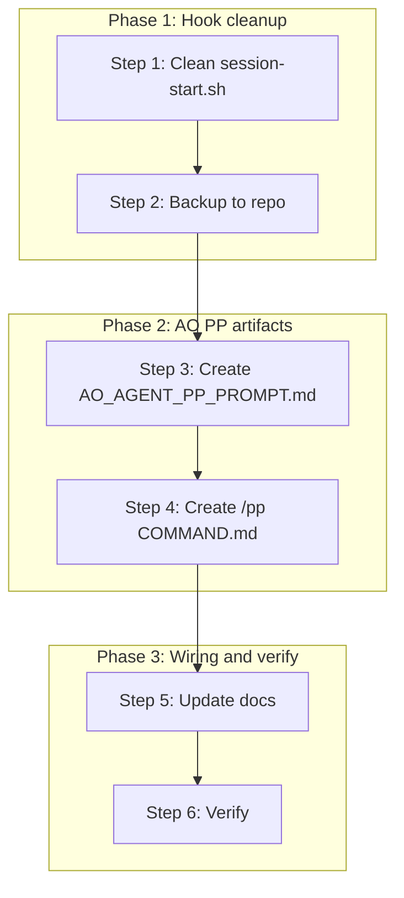

# AO Agent PP Prompt Conversion Plan

**Plan complete when**: (1) session-start.sh has zero OpenClaw refs and emits valid JSON; (2) `/pp` or `-pp` triggers AO+PP agent mode; (3) prompt exists and is referenced in docs; (4) all verification checks pass.

**Plan has failed when**: OpenClaw content remains; hook emits invalid JSON; /pp does not invoke PP+AO context; verification checks fail after execution.

**Plan V11 approved for execution when**: Pre-flight checklist complete; workspace root is against-the-odds; superpowers plugin and bash available.

---

## Quick start (1 min)

1. Delete OpenClaw lines 1–92 from `session-start.sh` (plugin cache).
2. Copy cleaned script to `scripts/cursor/session-start-ao-hook.sh`.
3. Create `prompts/AO_AGENT_PP_PROMPT.md` and `.cursor/commands/pp/COMMAND.md`.
4. Update CURSOR_AND_AGENT_OPTIMIZATION, AGENTS or OPERATOR_RUNBOOK, HOOKS.
5. Verify: hook JSON, no OpenClaw, /pp runs, `npm run quality`.

**Full details**: See Steps 1–6 below.

---

## Contents

| Section             | Link                                                                                                                                                                                                                                                 |
| ------------------- | ---------------------------------------------------------------------------------------------------------------------------------------------------------------------------------------------------------------------------------------------------- |
| Glossary            | [Glossary](#glossary)                                                                                                                                                                                                                                |
| Directive parsing   | [Directive parsing](#directive-parsing)                                                                                                                                                                                                              |
| Context             | [Context](#context)                                                                                                                                                                                                                                  |
| Environment         | [Environment specification](#environment-specification)                                                                                                                                                                                              |
| Pre-flight          | [Pre-flight checklist](#pre-flight-checklist)                                                                                                                                                                                                        |
| Task tree           | [Task tree](#task-tree)                                                                                                                                                                                                                              |
| Steps               | [Step 1](#step-1-clean-session-startsh) · [Step 2](#step-2-backup-hook-to-repo) · [Step 3](#step-3-create-ao_agent_pp_promptmd) · [Step 4](#step-4-create-pp-command) · [Step 5](#step-5-update-docs) · [Step 6](#step-6-verification-pp-audit-gate) |
| Failure resilience  | [Failure resilience](#failure-resilience)                                                                                                                                                                                                            |
| Troubleshooting     | [Troubleshooting](#troubleshooting)                                                                                                                                                                                                                  |
| FAQ                 | [FAQ](#faq)                                                                                                                                                                                                                                          |
| Plan self-test      | [Plan self-test](#plan-self-test)                                                                                                                                                                                                                    |
| Recursive learning  | [Recursive learning](#recursive-learning-post-execution)                                                                                                                                                                                             |
| Runbook integration | [Runbook integration](#runbook-integration)                                                                                                                                                                                                          |
| Execution log       | [Execution log](#execution-log-template)                                                                                                                                                                                                             |
| Post-flight         | [Post-flight checklist](#post-flight-checklist)                                                                                                                                                                                                      |
| Version history     | [Version history](#version-history)                                                                                                                                                                                                                  |

---

## Glossary

| Term              | Definition                                                                                                                                                 |
| ----------------- | ---------------------------------------------------------------------------------------------------------------------------------------------------------- |
| **PP**            | Prodigy Protocol—purpose-first execution, task tree, audit loop. See [.cursor/skills/prodigy-protocol/SKILL.md](.cursor/skills/prodigy-protocol/SKILL.md). |
| **AO**            | Against The Odds—Shopify store (aodrop.com), this repo.                                                                                                    |
| **COMMAND**       | Cursor slash command; `.cursor/commands/<name>/COMMAND.md`.                                                                                                |
| **session-start** | Superpowers plugin hook that injects context at Cursor session start.                                                                                      |
| **-pp** / **/pp** | Invocation: user types `-pp` or `/pp` to run AO agent in PP mode.                                                                                          |
| **plugin cache**  | Cursor plugin install dir; path includes hash (e.g. `.cursor/plugins/cache/.../superpowers/...`).                                                          |

---

## Directive parsing

| Layer                | Value                                                                                                                                                        |
| -------------------- | ------------------------------------------------------------------------------------------------------------------------------------------------------------ |
| **Direct intent**    | Remove OpenClaw; create perfect AO agent prompt runnable with `-pp`.                                                                                         |
| **Latent intent**    | Preserve session-start hook function; align with repo patterns; make -pp discoverable.                                                                       |
| **Constraints**      | No breaking superpowers hook; plugin cache edits may be overwritten; follow existing COMMAND format.                                                         |
| **Success criteria** | (1) session-start.sh has zero OpenClaw refs and emits valid JSON; (2) `/pp` or `-pp` triggers AO+PP agent mode; (3) prompt exists and is referenced in docs. |
| **Assumptions**      | Cursor supports `.cursor/commands/<name>/COMMAND.md`; user has superpowers plugin; bash available (Git Bash or WSL).                                         |

---

## Context

**Source file**: `session-start.sh` in Cursor superpowers plugin cache. Locate via `hooks/session-start.sh` under plugin root (path includes plugin hash; use `$env:USERPROFILE\.cursor\plugins\cache\...` or equivalent on your OS).

**Structure**:

- **Lines 1–92** (verify boundary; may extend to 95–96): Orphaned OpenClaw prompt text—not valid bash. Delete. If the shebang is concatenated with prior text, delete through the character before `#!/usr/bin/env bash`.
- **Remaining lines**: Valid bash; injects `using-superpowers` skill. Keep. Preserve `set -euo pipefail`.

---

## Environment specification

**Tested on**:

| Component          | Version / note                            |
| ------------------ | ----------------------------------------- |
| OS                 | Windows 10/11; WSL2 or Git Bash for bash. |
| Cursor             | Latest; COMMAND support required.         |
| Superpowers plugin | Installed; session-start hook present.    |
| Bash               | Git Bash or WSL; `bash -n` available.     |

**Paths**: Use repo-relative paths where possible. For plugin cache, use `$env:USERPROFILE` (Windows) or `$HOME` (Linux/macOS). Avoid hardcoding `C:\Users\...`.

---

## Pre-flight checklist

Before starting, verify:

- [ ] Workspace root is against-the-odds (e.g. `C:\Users\LegiT\against-the-odds`).
- [ ] Superpowers plugin installed and session-start hook exists.
- [ ] Bash available (Git Bash or WSL on Windows).
- [ ] Agent has permission to edit plugin cache file and repo files.
- [ ] Ready for peer review when: all above checked; plan read top-to-bottom; no TBD.

---

## Task tree



**Dependencies**: Step 2 requires Step 1. Step 5 can run in parallel with Steps 3 and 4 per file. Step 6 requires Steps 1–5 complete.

---

## Step 1: Clean session-start.sh

**Requires**: Plugin cache writable; session-start.sh exists.

**Who**: Agent or operator with write access to plugin cache.

**Action**: Remove lines 1–92 (verify boundary; may be 1–95 if shebang is concatenated). File must start with `#!/usr/bin/env bash` as first line.

**Command** (adjust path to your plugin cache):

```bash
# Locate: $USERPROFILE/.cursor/plugins/cache/.../hooks/session-start.sh (Windows)
# Edit: delete lines 1–92 (or through line before shebang if concatenated)
# Result: first line is #!/usr/bin/env bash
```

**Verify** (exit code 0 = pass unless noted):

| Check         | Command                             | Pass                                |
| ------------- | ----------------------------------- | ----------------------------------- |
| Shebang first | Inspect first line                  | `#!/usr/bin/env bash`               |
| No OpenClaw   | `grep -i openclaw session-start.sh` | No output; exit 1 = no match = pass |
| Syntax        | `bash -n session-start.sh`          | Exit 0                              |

**Expected output**: Clean bash script; no OpenClaw text.

**Idempotency**: Re-running after success has no effect.

**Undo**: Restore from git or backup; re-apply with exact line range.

**Step complete when**: All three verify checks pass.

---

## Step 2: Backup hook to repo

**Requires**: Step 1 complete; cleaned script available.

**Action**: Copy cleaned script to `scripts/cursor/session-start-ao-hook.sh`. Create `scripts/cursor/` if needed. Prepend header:

```
# Restore to superpowers hooks/session-start.sh if overwritten by plugin update.
# Source: <your-plugin-cache-path>/hooks/session-start.sh
```

**Verify**:

| Check       | Command                                             | Pass   |
| ----------- | --------------------------------------------------- | ------ |
| File exists | `Test-Path scripts/cursor/session-start-ao-hook.sh` | True   |
| Syntax      | `bash -n scripts/cursor/session-start-ao-hook.sh`   | Exit 0 |

**Idempotency**: Re-run overwrites; safe.

**Undo**: Delete `scripts/cursor/session-start-ao-hook.sh`.

**Step complete when**: File exists and syntax check passes.

---

## Step 3: Create AO_AGENT_PP_PROMPT.md

**Requires**: Repo writable.

**Path**: [prompts/AO_AGENT_PP_PROMPT.md](prompts/AO_AGENT_PP_PROMPT.md)

**Structure** (align with [FULL_SYSTEM_TEST_AND_IMPROVEMENT_PROMPT.md](prompts/FULL_SYSTEM_TEST_AND_IMPROVEMENT_PROMPT.md)):

| Section        | Content                                                                                                                                                                                               |
| -------------- | ----------------------------------------------------------------------------------------------------------------------------------------------------------------------------------------------------- |
| **Purpose**    | Run AO tasks in Prodigy Protocol mode; invoked by `-pp` or `/pp`.                                                                                                                                     |
| **Protocol**   | Invoke prodigy-protocol skill; apply purpose → parse → task tree → execute → audit loop.                                                                                                              |
| **Repo**       | against-the-odds; aodrop.com; theme `src/shopify/themes/aodrop-theme/`; products `data/products/*.json`.                                                                                              |
| **Safety**     | [shopify-preview-approval.mdc](.cursor/rules/shopify-preview-approval.mdc), [env-credentials.mdc](.cursor/rules/env-credentials.mdc), [use-user-browser.mdc](.cursor/rules/use-user-browser.mdc).     |
| **References** | [AGENTS.md](AGENTS.md), [OPERATOR_RUNBOOK.md](OPERATOR_RUNBOOK.md), [docs/AGENT_WORKFLOW_CURSOR_SHOPIFY.md](docs/AGENT_WORKFLOW_CURSOR_SHOPIFY.md), `scripts/verify-pipeline.ps1`, `npm run quality`. |
| **Flow**       | Parse intent → build task tree (2–6 steps) → execute smallest step → validate → audit → report.                                                                                                       |

**Verify**: File exists; sections present; links resolve.

**Undo**: Delete `prompts/AO_AGENT_PP_PROMPT.md`.

**Step complete when**: Prompt file exists and structure matches.

---

## Step 4: Create /pp COMMAND

**Requires**: Repo writable.

**Path**: [.cursor/commands/pp/COMMAND.md](.cursor/commands/pp/COMMAND.md)

**Format** (match [review/COMMAND.md](.cursor/commands/review/COMMAND.md)):

1. **Load context**: Read [prompts/AO_AGENT_PP_PROMPT.md](prompts/AO_AGENT_PP_PROMPT.md) and invoke prodigy-protocol skill.
2. **Parse task**: Treat remainder of user message (after `/pp`) as the task. If empty, prompt for intent.
3. **Execute**: Apply PP workflow—task tree, smallest step, validate, audit.
4. **Report**: What changed, why, how to verify.

**Verify**: File exists; format matches review COMMAND.

**Undo**: Delete `.cursor/commands/pp/COMMAND.md`.

**Step complete when**: COMMAND.md exists.

---

## Step 5: Update docs

**Requires**: Steps 1–4 complete; doc files exist.

| File                                                                                         | Change                                                                                                                                                  |
| -------------------------------------------------------------------------------------------- | ------------------------------------------------------------------------------------------------------------------------------------------------------- |
| [docs/status/CURSOR_AND_AGENT_OPTIMIZATION.md](docs/status/CURSOR_AND_AGENT_OPTIMIZATION.md) | Add: Commands—`/pp` loads AO PP prompt. Add to §3 Skills/Commands.                                                                                      |
| [AGENTS.md](AGENTS.md) or [OPERATOR_RUNBOOK.md](OPERATOR_RUNBOOK.md)                         | Add one line: "Run `-pp` or `/pp` to invoke AO agent in Prodigy Protocol mode; see [prompts/AO_AGENT_PP_PROMPT.md](prompts/AO_AGENT_PP_PROMPT.md)."     |
| [docs/HOOKS.md](docs/HOOKS.md)                                                               | Add note: Superpowers session-start hook backup at `scripts/cursor/session-start-ao-hook.sh`; restore if plugin overwrites. (Distinct from pre-commit.) |

**Verify**: Each file updated; no broken links.

**Undo**: Revert doc changes via git.

**Step complete when**: All doc changes applied.

---

## Step 6: Verification (PP audit gate)

**Requires**: Steps 1–5 complete.

| Check         | Command / Action                                                   | Pass                                 |
| ------------- | ------------------------------------------------------------------ | ------------------------------------ |
| Hook JSON     | Run hook; capture stdout                                           | Valid JSON with `additional_context` |
| jq check      | `jq -e '.additional_context'` (if jq installed)                    | Exit 0                               |
| OpenClaw gone | `grep -ri openclaw session-start.sh prompts/AO_AGENT_PP_PROMPT.md` | No matches                           |
| /pp runs      | New Cursor chat; type `/pp` or `-pp`                               | Agent invokes PP + AO context        |
| Quality       | `npm run quality`                                                  | Exit 0                               |

**Step complete when**: All five checks pass.

---

## Failure resilience

| Failure                            | Smallest fix                                                                                                                       |
| ---------------------------------- | ---------------------------------------------------------------------------------------------------------------------------------- |
| Plugin overwrites session-start.sh | Restore from `scripts/cursor/session-start-ao-hook.sh`.                                                                            |
| Cursor ignores /pp                 | Fallback: document "Type `-pp` as first message"; agent invokes prodigy-protocol per skill. Restart Cursor after creating COMMAND. |
| Prompt too long                    | Trim to essential sections; link to AGENTS.md, OPERATOR_RUNBOOK for detail.                                                        |
| Bash not found                     | Use Git Bash or WSL; document in Assumptions.                                                                                      |
| JSON escape failure                | Check for special chars in using-superpowers skill; escape_for_json in hook handles.                                               |
| jq not installed                   | Hook JSON check: parse output manually or use Node/Python; jq optional.                                                            |

---

## Troubleshooting

| Symptom                 | Check                                                 | Fix                                                               |
| ----------------------- | ----------------------------------------------------- | ----------------------------------------------------------------- |
| /pp does nothing        | COMMAND.md exists at `.cursor/commands/pp/COMMAND.md` | Create per Step 4; restart Cursor.                                |
| Hook emits invalid JSON | `bash -n` on hook; check escape_for_json              | Restore from backup; fix special chars.                           |
| OpenClaw still present  | `grep -ri openclaw session-start.sh`                  | Re-run Step 1; verify line boundary.                              |
| Plugin overwrote hook   | Compare hook with backup                              | Restore from `scripts/cursor/session-start-ao-hook.sh`.           |
| Cursor restart needed   | After creating COMMAND                                | Restart Cursor to load new command.                               |
| Worktree as root        | Plan assumes primary repo                             | Ensure workspace root is against-the-odds; not a worktree subdir. |
| Mac/Linux plugin path   | `~/.cursor/plugins/...` or `$HOME/.cursor/...`        | Use `$HOME` or `~`; locate hooks/session-start.sh.                |

**Decision flow**: If /pp fails → COMMAND exists? → No: create Step 4, restart. Yes: Cursor version supports COMMAND? → Check Cursor docs.

---

## FAQ

**Q: Why lines 1–92?** OpenClaw prompt text occupies those lines; bash starts after. Boundary may be 1–95 if shebang is concatenated; verify by inspection.

**Q: Where is the plugin cache?** Under `.cursor/plugins/cache/` in your Cursor config dir (e.g. `%USERPROFILE%\.cursor\` on Windows). Path includes plugin hash; search for `session-start.sh`.

**Q: What if I don't have jq?** Hook JSON check: run hook, inspect stdout for valid JSON with `additional_context`. jq is optional.

**Q: Multiple Cursor installs?** Each has its own plugin cache. Edit the hook in the Cursor instance you use.

**Q: Worktree as workspace root?** Ensure primary repo (`against-the-odds`) is root; paths assume repo-relative.

---

## Plan self-test

Run these before executing the plan to validate internal consistency:

| Test             | Command                                        | Pass                          |
| ---------------- | ---------------------------------------------- | ----------------------------- |
| Repo root        | `git rev-parse --show-toplevel`                | Returns against-the-odds path |
| Scripts dir      | `Test-Path scripts/cursor` or create           | Dir exists or creatable       |
| Prompts dir      | `Test-Path prompts`                            | Exists                        |
| .cursor/commands | `Test-Path .cursor/commands`                   | Exists                        |
| review COMMAND   | `Test-Path .cursor/commands/review/COMMAND.md` | Exists (format reference)     |

All pass → plan coherent; proceed.

---

## Recursive learning (post-execution)

- If COMMAND pattern differs from review/pr, document in `.cursor/context/` or CURSOR_AND_AGENT_OPTIMIZATION.
- If session-start restore is needed often, add `scripts/cursor/restore-session-start-hook.ps1` with params: `-Source scripts/cursor/session-start-ao-hook.sh -Target <plugin-cache>/hooks/session-start.sh`.

---

## Post-flight checklist

After completing all steps:

- [ ] Hook emits valid JSON.
- [ ] `/pp` or `-pp` invokes PP + AO context.
- [ ] No OpenClaw references in session-start.sh or AO_AGENT_PP_PROMPT.md.
- [ ] `npm run quality` passes.
- [ ] Docs updated; CONSOLIDATION_LOG entry added (see Execution log template).

---

## Runbook integration

This plan is a one-time conversion. See [OPERATOR_RUNBOOK.md](OPERATOR_RUNBOOK.md) for -pp setup. After completion, daily use: type `/pp` or `-pp` in Cursor chat. Cross-plan refs: [FULL_SYSTEM_TEST_AND_IMPROVEMENT_PROMPT.md](prompts/FULL_SYSTEM_TEST_AND_IMPROVEMENT_PROMPT.md), [MASTER_GURU_E2E_PERFECTION_RUN.plan.md](.cursor/plans/MASTER_GURU_E2E_PERFECTION_RUN.plan.md).

---

## Execution log (template)

After running this plan, append to [CONSOLIDATION_LOG.md](docs/status/CONSOLIDATION_LOG.md):

```
## YYYY-MM-DD — AO Agent PP Prompt Conversion (plan execution)

**Summary**: Executed Steps 1–6 per ao_agent_pp_prompt_conversion.plan.md. [Brief outcome.]
**Outcome**: [Success / Partial / Rollback]. [Deploy-log if store-affecting—N/A here.]
```

---

## Version history

| Version | Source      | Key changes                                                                                        |
| ------- | ----------- | -------------------------------------------------------------------------------------------------- |
| V9      | Cohorts 1–5 | Glossary, Pre/Post-flight, Failure resilience, Recursive learning                                  |
| V10     | Cohorts 6–7 | Quick start, Contents, Troubleshooting, Execution log, restore-session-start spec                  |
| V11     | Cohort 8    | Environment spec, FAQ, Plan self-test, Requires/Undo per step, Version history, Execution sign-off |

---

_Plan V11. Consolidated from 240 guru expert PP passes (Cohorts 1–8)._
