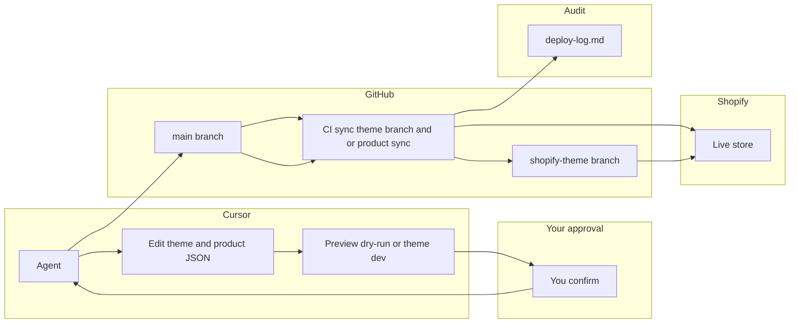

# Cursor–GitHub–Shopify Pipeline (Research-Backed Plan)

**Purpose**: Seamless, secure, end-to-end workflow so any Cursor agent/team can update the Shopify store (theme + products) from GitHub, with preview-before-apply, rollback logs, and full agent authority under your approval.

**Research sources**: Shopify theme architecture and GitHub integration docs, Shopify version control best practices, REST Admin API rate limits, GitHub Actions secrets and PowerShell on Ubuntu, rollback strategies.

---

## 1. Repository structure and Shopify GitHub connection (perfected)

### 1.1 Official requirements (Shopify)

- **Theme structure**: The connected **branch root** must match the [default Shopify theme folder structure](https://shopify.dev/docs/storefronts/themes/architecture#directory-structure-and-component-types): `assets/`, `config/`, `layout/` (with `theme.liquid` required), `locales/`, `sections/`, `snippets/`, `templates/`. Subdirectories other than these are not supported. [Shopify theme architecture](https://shopify.dev/docs/storefronts/themes/architecture)
- **Branch**: "You can connect only branches that match the default Shopify theme folder structure." Folders that don't match are ignored. [Shopify GitHub integration](https://shopify.dev/docs/storefronts/themes/tools/github#repository-structure)
- **Monorepo**: Shopify explicitly recommends **"Separate source code and compiled code using branches (recommended)"** using `git subtree` to extract compiled theme to a branch that can be connected. Alternative: separate repositories for source vs compiled theme. [Version control for Shopify themes](https://shopify.dev/docs/storefronts/themes/best-practices/version-control#separate-source-code-and-compiled-code-using-branches-recommended)

### 1.2 Recommended approach (this repo)

**Option B – Theme-only branch via git subtree (recommended)**

1. **One-time**: Pull live theme into repo: `.\scripts\shopify\theme-pull.ps1` so `src/shopify/themes/aodrop-theme/` contains full theme (layout/, config/, sections/, etc.).
2. **Create theme-only branch**: Use `git subtree split` to create a branch whose root is the theme:
   ```bash
   git subtree split --prefix=src/shopify/themes/aodrop-theme -b shopify-theme
   ```
   Push `shopify-theme` to origin. [Shopify version control](https://shopify.dev/docs/storefronts/themes/best-practices/version-control) recommends this pattern.
3. **Connect in Shopify Admin**: Online Store → Themes → Add theme → Connect from GitHub → select this repo and branch **shopify-theme**. Shopify will see theme at root.
4. **Keep branch in sync**: On every push to `main` that touches `src/shopify/themes/aodrop-theme/`, re-run subtree split and force-push `shopify-theme` (or use a CI job to do it). Tools like [splitsh/lite](https://github.com/splitsh/lite) or a workflow that runs `git subtree split` and push are valid.

**Alternative – Separate theme repo**: New repo containing only theme at root; sync from this repo via script or CI. More isolation; more repos to manage.

**Critical**: Do not connect `main` directly if the repo root is not a theme (docs/, scripts/, src/ at root). Only connect a branch where the root is the theme.

---

## 2. End-to-end agent workflow (theme + products)

### 2.1 Product listing flow (research-aligned)

- **Schema**: Product JSON in `data/products/*.json` must match [Shopify Product resource](https://shopify.dev/docs/api/admin-rest/latest/resources/product). Existing [data/products/example-hoodie.json](data/products/example-hoodie.json) is a valid template (title, body_html, vendor, product_type, tags, status, variants, images, options).
- **API**: [scripts/shopify/sync-products.ps1](scripts/shopify/sync-products.ps1) uses REST Admin API. **REST is legacy** (Oct 2024); new apps should use GraphQL. For existing script: keep REST but add **rate-limit handling**: 2 req/s (standard), bucket 40; on HTTP 429 use `Retry-After` header and 1s backoff. [REST Admin API rate limits](https://shopify.dev/docs/api/admin-rest/usage/rate-limits#avoiding-rate-limit-errors). Product/variant throttle: when store has 50k+ variants, max 1,000 new variants/day. [Resource-based limits](https://shopify.dev/docs/api/admin-rest/usage/rate-limits#resource-based-rate-limits)
- **Flow**: (1) Agent creates/edits JSON in `data/products/`. (2) **Preview**: Run `.\scripts\shopify\sync-products.ps1 -DryRun`; show output. (3) **Approval**: You confirm. (4) **Apply**: Run sync without `-DryRun`; commit and push. (5) **Log**: Append to deploy log (see §4).

### 2.2 Theme/page flow

- **Edit**: Agent edits files under `src/shopify/themes/aodrop-theme/`.
- **Preview**: Run `shopify theme dev --store=aodrop.com --path=src/shopify/themes/aodrop-theme` (or equivalent) for live preview URL; or open PR and review diff.
- **Approval**: You confirm.
- **Apply**: Commit and push to `main`; CI updates `shopify-theme`; Shopify deploys from connected branch. Per [Shopify GitHub integration](https://shopify.dev/docs/storefronts/themes/tools/github): "When your theme is connected to a GitHub repository... changes are automatically committed to your repository... When you push a change to the branch from your local machine, the Last saved date on the theme updates."

### 2.3 Documentation and Cursor rules

- **Single doc**: [docs/AGENT_WORKFLOW_CURSOR_SHOPIFY.md](docs/AGENT_WORKFLOW_CURSOR_SHOPIFY.md) – step-by-step for product request, theme request, preview, approval, apply, rollback; reference this plan for structure and API/rate-limit notes.
- **Cursor rule**: Add rule (e.g. `.cursor/rules/shopify-preview-approval.mdc`) requiring **preview before live store changes**: show dry-run output or theme dev URL or PR summary, then get explicit user approval before running sync without DryRun, pushing to `main`, or merging. No permanent store/branch updates without approval.

---

## 3. Preview-before-permanent and approval

- **Products**: Always run `sync-products.ps1 -DryRun` and show output before running without `-DryRun`. Optional wrapper script: dry-run → "Approve? (y/n)" → real sync.
- **Theme**: Require either (a) local preview via `shopify theme dev` and your "looks good", or (b) PR with description; merge only after your approval.
- **Cursor rule**: Encode "preview then approve then apply" so every agent follows it.
- **Branch protection**: Require PR (and optional status checks) for `main` so PR diff acts as preview. [GitHub branch protection](https://docs.github.com/en/repositories/configuring-branches-and-merges-in-your-repository/managing-branches-in-your-repository/managing-a-branch-protection-rule)

---

## 4. Rollback and deploy logs (perfected)

- **Location**: Use a **committed** file so history is in repo and available to agents. Recommended: `docs/status/deploy-log.md` (append-only). Do not rely only on gitignored `logs/` for rollback metadata.
- **Format**: Each entry: **Timestamp** (ISO), **Action** (e.g. "product sync", "theme deploy"), **Branch/commit** (e.g. `main` @ abc123 or `shopify-theme` @ def456), **Summary** (e.g. "Added product X", "Updated section Y"), **Rollback** (e.g. "Revert commit abc123 and push" or "Restore data/products/previous.json and run sync-products.ps1").
- **Who writes**: (1) Scripts: on success, append one line (or print "Append to deploy-log: ..." for agent). (2) Agent: Cursor rule – after any deploy/sync, agent appends entry and commits log (no secrets in log).
- **Rollback procedures**: (1) **Theme**: In Shopify Admin, theme card → Actions → **Reset to last commit** [Shopify GitHub integration](https://shopify.dev/docs/storefronts/themes/tools/github); or revert commit on `shopify-theme` and push. (2) **Products**: Revert product JSON in repo, run sync; or fix in Admin and export back. Git gives unlimited history vs Shopify's 20-version limit for native theme versions.

---

## 5. Security (permanent, research-backed)

- **Secrets**
  - **Never** commit `.env`, `.env.local`, or tokens. [.gitignore](.gitignore) and [.cursor/rules/env-credentials.mdc](.cursor/rules/env-credentials.mdc) already enforce.
  - **GitHub Actions**: Use only repository/environment **Secrets** (Settings → Secrets and variables → Actions). Secrets are encrypted; GitHub redacts known patterns from logs. Pass secrets as **environment variables**, not command-line args, to reduce exposure. [Using secrets in GitHub Actions](https://docs.github.com/en/actions/security-guides/using-secrets-in-github-actions)
  - **Pre-commit or CI**: Add a check (e.g. secret-scan or blocklist for `shpat_`, `ghp_`, `shpss_`) to prevent accidental commit. Document in [docs/security/](docs/security/).

- **Repository visibility**
  - **Private**: Maximum privacy; no code/docs visible publicly. GitHub Settings → General → Danger zone → Change visibility.
  - **Public**: Safe only if no secrets ever committed; all credentials in `.env.local` (local) and GitHub Secrets. Assume code and docs are visible.

- **Branch protection**
  - **main** (and optionally `shopify-theme`): Require pull request before merging; at least one approval (or your merge). Use status checks (CI, lint) if desired. Document in repo so agents open PRs for store-affecting changes.

- **Agent authority**
  - Agent may run any repo script, edit any file, push/merge **after** preview and your explicit approval for live store changes. No committing secrets; append to deploy log after apply.

- **Audit doc**: [docs/security/AGENT_AND_REPO_SECURITY.md](docs/security/) – where secrets live, preview-before-apply, branch protection, deploy log, credential rotation.

---

## 6. CI/CD and scripts (perfected)

### 6.1 shopify-sync.yml (products)

- **Current gap**: Workflow has placeholder "Syncing products..." and does not run [scripts/shopify/sync-products.ps1](scripts/shopify/sync-products.ps1).
- **Options**:  
  (A) **PowerShell on Ubuntu**: Use `shell: pwsh` and run the script. Script must be **cross-platform**: resolve repo root from `$PSScriptRoot` (not hardcoded `C:\Users\...`); use `Join-Path` and forward slashes or `[System.IO.Path]::Combine` for paths. [Building and testing PowerShell](https://docs.github.com/en/actions/automating-builds-and-tests/building-and-testing-powershell)  
  (B) **Node.js sync**: Add a small Node script that reads `data/products/*.json` and calls Shopify Admin API (REST or GraphQL) with retry/backoff; run in CI without PowerShell. Same JSON schema as existing script.
- **Secrets**: Pass `SHOPIFY_ACCESS_TOKEN` and `SHOPIFY_STORE_DOMAIN` as **env** (not in command line). Example:
  ```yaml
  env:
    SHOPIFY_STORE_DOMAIN: ${{ secrets.SHOPIFY_STORE_DOMAIN }}
    SHOPIFY_ACCESS_TOKEN: ${{ secrets.SHOPIFY_ACCESS_TOKEN }}
  ```
- **Rate limits**: If using REST in CI, add retry on 429 with 1s backoff (and respect `Retry-After` header if present).

### 6.2 Theme-only branch sync

- **Workflow**: On push to `main` with changes under `src/shopify/themes/aodrop-theme/`, run:
  ```bash
  git subtree split --prefix=src/shopify/themes/aodrop-theme -b shopify-theme
  git push origin shopify-theme --force
  ```
  Use a dedicated job with `actions/checkout@v4` and `token` with write access for pushing. Document in [docs/UPDATE_SHOPIFY_FROM_CURSOR.md](docs/UPDATE_SHOPIFY_FROM_CURSOR.md).

### 6.3 Script hardening

- **sync-products.ps1**: Add retry/backoff for 429; use `$PSScriptRoot` to resolve repo root; comment pointing to agent workflow doc.
- **theme-pull.ps1**, **update-theme.ps1**: Resolve repo root from script location; support both Windows and Unix paths where relevant.
- **Remove hardcoded** `C:\Users\LegiT\against-the-odds` from all scripts so they work in any worktree/CI.

---

## 7. API and rate limits (implementation notes)

- **REST Admin API**: 2 req/s (standard), bucket 40; 429 returns `Retry-After`. Product/variant throttle when store has 50k variants: max 1,000 new variants/day. [REST rate limits](https://shopify.dev/docs/api/admin-rest/usage/rate-limits)
- **GraphQL**: Preferred for new work (REST legacy Oct 2024). If migrating product sync to GraphQL later, use `productCreate` mutation and cost-based rate limits (e.g. 100 points/s standard).
- **Sync script**: Stagger requests; on 429 wait `Retry-After` or 1s; do not ignore errors.

---

## 8. Implementation order (recommended)

1. **Theme in repo**: Run `.\scripts\shopify\theme-pull.ps1` once; commit full theme under `src/shopify/themes/aodrop-theme`.
2. **Theme-only branch**: Create `shopify-theme` via `git subtree split`; push; connect in Shopify Admin; verify deploy on push (manually or with CI).
3. **Deploy/rollback log**: Create `docs/status/deploy-log.md`; document format and rollback steps; add Cursor rule to append after apply.
4. **Preview + approval rule**: Add `.cursor/rules/shopify-preview-approval.mdc`; reference in agent workflow doc.
5. **Agent workflow doc**: Write [docs/AGENT_WORKFLOW_CURSOR_SHOPIFY.md](docs/AGENT_WORKFLOW_CURSOR_SHOPIFY.md) (product flow, theme flow, preview, approval, apply, rollback; cite this plan and Shopify/GitHub docs).
6. **shopify-sync.yml**: Implement real product sync (PowerShell with cross-platform paths + retry, or Node script); pass secrets via env; optionally append to deploy-log from CI or instruct agent.
7. **Theme-branch CI**: Add workflow to sync `shopify-theme` from `main` on push when theme dir changes.
8. **Security**: Pre-commit or CI secret check; branch protection (document + apply); [docs/security/AGENT_AND_REPO_SECURITY.md](docs/security/).
9. **Script cleanup**: Remove hardcoded paths; use `$PSScriptRoot` (or equivalent) for repo root in all scripts.
10. **Repo visibility**: If desired, set repository to private in GitHub Settings.

---

## 9. Summary diagram



---

## 10. References (reliable sources)

| Topic                  | Source                                                                                                                            |
| ---------------------- | --------------------------------------------------------------------------------------------------------------------------------- |
| Theme structure        | [Shopify theme architecture](https://shopify.dev/docs/storefronts/themes/architecture)                                            |
| GitHub integration     | [Shopify GitHub integration for themes](https://shopify.dev/docs/storefronts/themes/tools/github)                                 |
| Version control        | [Version control for Shopify themes](https://shopify.dev/docs/storefronts/themes/best-practices/version-control)                  |
| REST rate limits       | [REST Admin API rate limits](https://shopify.dev/docs/api/admin-rest/usage/rate-limits)                                           |
| GitHub Actions secrets | [Using secrets in GitHub Actions](https://docs.github.com/en/actions/security-guides/using-secrets-in-github-actions)             |
| PowerShell on Ubuntu   | [Building and testing PowerShell](https://docs.github.com/en/actions/automating-builds-and-tests/building-and-testing-powershell) |
| Product resource       | [Shopify Product REST resource](https://shopify.dev/docs/api/admin-rest/latest/resources/product)                                 |

---

---

## Implementation status

- **Deploy log**: `docs/status/deploy-log.md` created with format; Cursor rule `.cursor/rules/shopify-preview-approval.mdc` requires preview + approval and appending to log after apply.
- **Agent workflow**: `docs/AGENT_WORKFLOW_CURSOR_SHOPIFY.md` added; security doc `docs/security/AGENT_AND_REPO_SECURITY.md` added.
- **Scripts**: `scripts/shopify/sync-products.ps1` hardened (repo root from `$PSScriptRoot`, cross-platform paths, 429 retry, API 2024-10). `theme-pull.ps1` and `update-theme.ps1` use repo root from script location.
- **CI**: `shopify-sync.yml` runs `sync-products.ps1` with pwsh; secrets via env. `sync-theme-branch.yml` runs on push to main (theme path), subtree-splits and pushes `shopify-theme`.
- **Security**: `ci.yml` has secret-scan job (blocklist for `shpat_`, `ghp_`, `shpss_` in tracked files).

**Remaining (manual)**: (1) Run `.\scripts\shopify\theme-pull.ps1` once and commit theme so `shopify-theme` branch has valid theme structure. (2) In Shopify Admin, connect repo branch **shopify-theme**. (3) Set GitHub Actions secrets `SHOPIFY_STORE_DOMAIN`, `SHOPIFY_ACCESS_TOKEN` if not already. (4) Optionally set repo to private in GitHub Settings.
