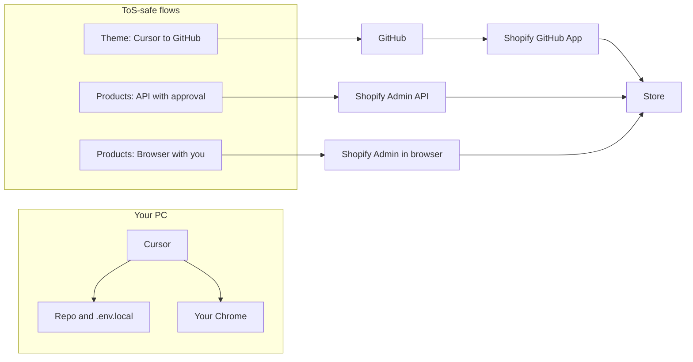

# Expert Team: Platform, Security, and Safe Operations Plan

## Scope and non-redundancy

**Already done (do not redo):** Phase 0 sign-off; full system analysis ([docs/status/FULL_SYSTEM_ANALYSIS.md](docs/status/FULL_SYSTEM_ANALYSIS.md)); architecture/code-quality and Prettier; workflow audit and sync.yml fix; test/coverage and E2E reports; coverage remediation plan ([docs/status/COVERAGE_REMEDIATION_PLAN.md](docs/status/COVERAGE_REMEDIATION_PLAN.md)); optimization report; verification sign-off ([docs/status/VERIFICATION_REPORT_20260130.md](docs/status/VERIFICATION_REPORT_20260130.md)); MASTER_EXECUTION_REPORT.

**Future work (reference only):** Raise coverage to 90%; E2E after `npx playwright install`; optional doc consolidation.

**This plan adds:** New agent roles (GitHub, Shopify, Cursor, Local PC, Security experts), one consolidated pass from fresh perspectives, and concrete decisions for: Shopify ToS/safety, browser vs API/CLI, what must stay local, and how to stay within Shopify/GitHub/Cursor rules without risking ban or PC compromise.

---

## 1. Operational model: Shopify (guru recommendation)

**Will Shopify ban or block if reviewed?**
Shopify’s API terms do **not** explicitly permit headless browser automation of the admin; they expect use of the **Admin API** (GraphQL/REST) with proper tokens and “build responsibly.” Automated scraping/headless admin automation can be treated as ToS‑sensitive.

**Recommended approach (Shopify + Cursor gurus):**

- **Theme:** Edit in Cursor under `src/shopify/themes/aodrop-theme/` → preview (`shopify theme dev` or GitHub PR) → **you confirm** (“does this look good?”) → push to `main` → Shopify GitHub App deploys. No headless Playwright against Shopify admin for theme.
- **Products (bulk):** Edit JSON in Cursor in `data/products/` → **dry-run** (`.\scripts\shopify\sync-products.ps1 -DryRun`) → **you confirm** → run sync once (Admin API from your PC). API use with a custom app and minimal scopes is ToS‑compliant.
- **Products (one-off) or settings:** Use **your open browser** (Cursor browser MCP) so you watch the agent navigate to Shopify Admin and make edits; agent **stops before Save** and asks “does this look good?” before finalizing. No headless browser; human-in-the-loop. Aligns with [.cursor/rules/use-user-browser.mdc](.cursor/rules/use-user-browser.mdc) and [.cursor/rules/shopify-preview-approval.mdc](.cursor/rules/shopify-preview-approval.mdc).

**Concrete decisions:**

- **Deprecate or gate** automated Playwright/headless runs against Shopify Admin (e.g. `tests/e2e/shopify-admin.spec.js`, `src/browser-automation/shopify-admin.js` used for unattended automation). Use them only in “user’s browser” or manual-test mode; document that headless admin automation is not recommended for ToS/compliance.
- **Keep** Admin API for product sync and read-only scripts (test-connection, fetch-store-data) with tokens from `.env.local`; document rate limits and scopes per [docs/security/00_security_checklist.md](docs/security/00_security_checklist.md).
- **Bypassing 3rd‑party security** here means: **not triggering** Shopify or GitHub security (no headless admin automation; use official API + user’s browser). No weakening of your or their security.

Result: **Functional, safe, and ToS‑aligned:** theme via GitHub; products via API (with approval) or browser-with-you-watching; you are always prompted before finalizing changes.

---

## 2. What must be stored locally (Local PC guru)

**Is anything on the repo required to be stored in your desktop files?**

- **Required only on your PC (never in repo):**
  `**.env.local**` — API tokens and secrets (GitHub PAT, Shopify Admin API token, etc.). Already gitignored; documented in [docs/CREDENTIALS_SETUP.md](docs/CREDENTIALS_SETUP.md) and [.cursor/rules/env-credentials.mdc](.cursor/rules/env-credentials.mdc). No duplication needed; one `.env.local` at repo root is enough.
- **Optional local-only:** Shopify CLI auth (`shopify auth login`) is stored in your user profile; not in repo. Theme dev preview runs locally.
- **Repo on your PC:** Clone or worktree location (e.g. `c:\Users\LegiT\against-the-odds`) is your choice. No requirement to copy repo contents elsewhere; everything runs from that path. **Nothing from the repo is required to be stored in a different desktop folder** except that `.env.local` must exist at repo root (and must not be committed).

**Local PC expert task (with your approval):** Gather PC specs (OS, RAM, Node version, disk) once for compatibility and performance notes (e.g. Node 20, PowerShell, Playwright). Can be done via read-only commands or a one-time checklist; stored in a short doc (e.g. `docs/status/LOCAL_PC_SPECS.md`) for future agents. No sensitive data.

---

## 3. Cursor and data boundary (Cursor guru)

**Cursor cloud:**
Cursor sends code and file content to Cursor’s services for AI. **Best practice:** Treat all secrets as **never** leaving your machine in chat or context: keep them only in `.env.local`; agent must not read `.env.local` into prompts or logs. For **non-secret** code and docs, using Cursor cloud is how Cursor works and gives the best results; document the boundary so you and future agents know what not to paste.

**Concrete:**

- Add or update a short “Cursor data boundary” note (e.g. in [docs/security/AGENT_AND_REPO_SECURITY.md](docs/security/AGENT_AND_REPO_SECURITY.md) or a dedicated `docs/security/CURSOR_DATA_BOUNDARY.md`): (1) Secrets only in `.env.local`; never in chat, logs, or committed files. (2) Non-secret repo content may be sent to Cursor for AI; user accepts this for normal editing. (3) Browser MCP uses your local Chrome; pages you open are not “sent to Cursor” beyond what’s needed for navigation/assistance.

---

## 4. Security experts (web / Cursor / GitHub / cloud / Shopify)

One consolidated **security audit** pass from the perspective of:

- **Web:** HTTPS only for Shopify/GitHub; no secrets in URLs or logs; browser MCP over local Chrome.
- **Cursor:** No secrets in prompts, rules, or docs; `.env.local` for setup only; preview-before-apply for store changes.
- **GitHub:** Prefer `GITHUB_TOKEN` in Actions; PAT only where needed (e.g. local scripts); least-privilege scopes; 2FA and branch protection as in [docs/security/00_security_checklist.md](docs/security/00_security_checklist.md).
- **Cloud (CI):** GitHub Actions secrets for SHOPIFY\_\* only where workflows need them; no mirror of full `.env.local`; permissions minimal (e.g. `contents: read` where sufficient).
- **Shopify:** Custom app with minimal scopes; token in `.env.local` and (if used) in GitHub Secrets; no headless admin automation; rate limits respected (document in runbook).

**Deliverable:** One **Security and Compliance Report** (e.g. `docs/status/SECURITY_COMPLIANCE_REPORT.md`) that: (1) Confirms current rules and docs alignment. (2) Records Shopify decision: no headless admin automation; API + user’s browser only. (3) Records what must stay local (`.env.local`). (4) Lists any one-off hardening actions (e.g. scan for accidental secret patterns, confirm `.gitignore`). No redundancy with full Phase 0 or re-auditing every file; build on [docs/security/AGENT_AND_REPO_SECURITY.md](docs/security/AGENT_AND_REPO_SECURITY.md) and [docs/security/00_security_checklist.md](docs/security/00_security_checklist.md).

---

## 5. New agent roles (single coordinated pass)

Execute **one** coordinated pass with the following roles. Each produces a short section or doc; no re-running Phase 0 or full system analysis.

| Role                    | Focus                                                                                                               | Output                                                                                                                                                                                                                                                               |
| ----------------------- | ------------------------------------------------------------------------------------------------------------------- | -------------------------------------------------------------------------------------------------------------------------------------------------------------------------------------------------------------------------------------------------------------------- |
| **GitHub guru**         | Actions (GITHUB_TOKEN vs PAT), branch strategy, secrets in CI, what runs in cloud vs local                          | Short section in Security/Compliance report or `docs/status/GITHUB_GURU_NOTES.md`: recommendations and current state.                                                                                                                                                |
| **Shopify guru**        | ToS alignment, API vs browser, rate limits, custom app lifecycle (legacy 2026), deprecate headless admin automation | Same report + update [docs/UPDATE_SHOPIFY_FROM_CURSOR.md](docs/UPDATE_SHOPIFY_FROM_CURSOR.md) or [docs/AGENT_WORKFLOW_CURSOR_SHOPIFY.md](docs/AGENT_WORKFLOW_CURSOR_SHOPIFY.md) with “browser-first + confirm before finalizing” and “no headless admin automation.” |
| **Cursor guru**         | Data boundary, rules (use-user-browser, shopify-preview-approval, env-credentials), what to never paste             | Cursor data boundary doc (see §3).                                                                                                                                                                                                                                   |
| **Local PC guru**       | With your approval: gather PC specs (OS, RAM, Node, disk); where repo and `.env.local` live; what runs locally      | `docs/status/LOCAL_PC_SPECS.md` (or equivalent); one-line note in runbook if needed.                                                                                                                                                                                 |
| **Security (combined)** | Web, Cursor, GitHub, cloud, Shopify as above; one audit pass                                                        | `docs/status/SECURITY_COMPLIANCE_REPORT.md` including Shopify/ToS decision and local-only requirements.                                                                                                                                                              |

**Execution order:**
(1) Local PC guru (specs + local-storage answer). (2) Shopify guru (ToS + browser-first decision + doc updates). (3) Cursor guru (data boundary doc). (4) GitHub guru (CI and tokens). (5) Security experts (consolidated report using outputs of 1–4).

---

## 6. What to do so it’s safe and operational

- **Functional:** Theme via Cursor → GitHub → Shopify App; products via dry-run → approve → sync (API) or via your browser with “does this look good?” before save. No headless Shopify admin automation.
- **Safe for you:** Secrets only in `.env.local`; never in chat or repo; preview-before-apply for all store changes; you confirm before finalizing.
- **PC/store/repo protected:** Existing security checklist and agent rules; one security compliance pass; minimal scopes and tokens; 2FA recommended.
- **Operational in Cursor:** Use Cursor for editing, tasks, and browser MCP (your Chrome) for Shopify Admin when you want to “watch and confirm”; API/CLI from terminal only when you’ve approved (e.g. after dry-run).
- **No rule-breaking:** Shopify: official API + user’s browser only; no headless admin. GitHub: GITHUB_TOKEN in Actions; PAT with least privilege. Cursor: no secrets in prompts.
- **No PC hacked:** No new services or open ports; `.env.local` stays local; browser MCP uses your existing Chrome; no execution of untrusted code beyond repo and npm scripts you already use.

---

## 7. Optional: deprecation note for headless Shopify admin tests

- In [tests/e2e/shopify-admin.spec.js](tests/e2e/shopify-admin.spec.js) or [src/browser-automation/shopify-admin.js](src/browser-automation/shopify-admin.js), add a short comment or README note: “Unattended headless automation of Shopify Admin is not recommended per Shopify API terms; use for manual or user-in-browser flows only.” No need to delete tests; gate or document so future agents don’t run them as unattended admin automation.

---

## 8. Summary diagram

---

## 9. Best way for both: multi-agent guru research (easy for you, easy for agent)

**Research basis:** UX guru (user ease), automation guru (agent executability), Cursor guru (single surface), Shopify guru (ToS + preview-before-apply), security guru (no new attack surface). Goal: one seamless flow that is easy for you to use and easy for the agent to execute reliably.

### 9.1 What makes it easy for you (user)

- **Single entry point:** You say what you want in **Cursor chat**. No need to open another app or remember scripts.
- **Single place to see “what’s pending”:** Instead of hunting through chat or terminal, you have **one artifact** the agent writes: a **pending-approval snapshot** (diff summary + dry-run output or theme preview link). You open that file (or a link) and see “this is what will change” in one place.
- **Single way to approve:** You reply in the **same Cursor chat** with “approve,” “yes,” or “looks good.” No extra UI or button to find.
- **Predictable flow every time:** Request → agent makes changes → agent shows snapshot → you approve in chat → agent applies and logs. Same for theme or products.
- **Optional one-click “show pending”:** A Cursor **task** (e.g. “Open pending approval”) can open the snapshot in **View → Simple Browser** so you don’t have to navigate to the file yourself.

### 9.2 What makes it easy for the agent (execution)

- **Single source of truth:** [docs/AGENT_WORKFLOW_CURSOR_SHOPIFY.md](docs/AGENT_WORKFLOW_CURSOR_SHOPIFY.md) and [.cursor/rules/shopify-preview-approval.mdc](.cursor/rules/shopify-preview-approval.mdc) define the steps. One extra step is standardized: **write snapshot to a standard location** before asking for approval.
- **Deterministic sequence:** (1) Edit files. (2) Run preview (dry-run or theme dev URL). (3) **Write pending-approval artifact** to `docs/status/pending-approval.md` (and optionally generate `docs/status/pending-approval.html`). (4) Tell you: “Pending changes are in docs/status/pending-approval.md; open it or run task ‘Open pending approval.’ When ready, say ‘approve’ in this chat.” (5) Wait for your message containing approval. (6) Apply (sync, push, or browser finalize). (7) Append to [docs/status/deploy-log.md](docs/status/deploy-log.md); clear or archive pending-approval.
- **One approval signal:** Approval = your reply in chat with “approve,” “yes,” “looks good,” or equivalent. No file polling or separate server; the agent already reads chat.
- **Snapshot = something the agent can always produce:** For products: dry-run output (and optional diff of `data/products/`). For theme: theme dev URL + short diff summary (or link to PR). Writing these into `pending-approval.md` (and optionally a minimal HTML that shows the same + “To approve: say ‘approve’ in Cursor chat”) gives a **lightweight local “UI”** without a new app or backend.

### 9.3 Lightweight local approval surface (no new app)

- **No separate app or server.** Use the repo and Cursor only.
- **Standard artifact:** `docs/status/pending-approval.md` (and optionally `docs/status/pending-approval.html`). Agent writes it when there are pending store-affecting changes; content: summary, diff or dry-run output, theme dev URL if applicable, and “To approve: reply in Cursor chat with ‘approve’ or ‘yes’.”
- **Optional HTML:** A simple generated HTML page (e.g. same content as the .md, styled for readability) so **View → Simple Browser** can show “what’s pending” in one click. Agent can generate it when writing the .md (e.g. via a small script or inline HTML).
- **Optional Cursor task:** “Open pending approval” → opens `docs/status/pending-approval.html` (or the .md) in Simple Browser. You run the task when the agent says “pending changes are ready”; you see the snapshot; you go back to chat and say “approve.”
- **Approval stays in chat:** So the agent does not need to poll files or run a server; it just waits for your next message and checks for approval keywords.

### 9.4 Unified flow (recommended)

1. **You (in Cursor chat):** “Add product X” or “Update homepage hero.”
2. **Agent:** Edits `data/products/` or `src/shopify/themes/aodrop-theme/`; runs `.\scripts\shopify\sync-products.ps1 -DryRun` or starts theme dev and gets preview URL.
3. **Agent:** Writes `docs/status/pending-approval.md` (and optionally `.html`) with: what will change, diff or dry-run output, theme URL if any, “To approve: say ‘approve’ in this chat.”
4. **Agent:** “Pending changes are in docs/status/pending-approval.md. You can run **Tasks → Open pending approval** to view them in Simple Browser, or open the file. When it looks good, reply here with ‘approve’ or ‘yes’.”
5. **You:** Open the file or run the task; review; reply in chat: “approve” or “looks good.”
6. **Agent:** Applies (sync without -DryRun, or push to main, or finalize in browser with you); appends to deploy-log.md; clears or archives pending-approval so the next run starts clean.

This is **easy for you** (one place to request, one place to see pending, one way to approve) and **easy for the agent** (one workflow, one artifact, one approval signal, no new infrastructure).

### 9.5 Implementation checklist (for execution phase)

- Add to [docs/AGENT_WORKFLOW_CURSOR_SHOPIFY.md](docs/AGENT_WORKFLOW_CURSOR_SHOPIFY.md): step “Write pending-approval snapshot to docs/status/pending-approval.md (and optionally .html)” after preview and before “Approval.”
- Add Cursor task “Open pending approval” that opens `docs/status/pending-approval.html` (or .md) in Simple Browser (or document “View → Simple Browser” and paste path).
- Add to [.cursor/rules/shopify-preview-approval.mdc](.cursor/rules/shopify-preview-approval.mdc): “Before asking for approval, write the snapshot to docs/status/pending-approval.md so the user has one place to review.”
- Ensure deploy-log append and optional “clear pending-approval after apply” are in the workflow doc.

---

## 10. Success criteria

- One Security and Compliance Report with Shopify (no headless admin), GitHub, Cursor, and local-only decisions.
- Docs updated: browser-first + “confirm before finalizing”; Cursor data boundary; optional LOCAL_PC_SPECS.
- **Unified flow (Section 9):** Pending-approval snapshot (docs/status/pending-approval.md and optionally .html), Cursor task “Open pending approval,” and workflow/rule updates so you have one place to see pending changes and one way to approve (chat); agent has one deterministic sequence and one approval signal.
- No re-run of Phase 0, full system analysis, or coverage/Prettier/sync fixes.
- You can operate safely from Cursor (theme via GitHub; products via API with approval or browser with you), with no headless Shopify automation and no secrets in chat or repo. Flow is easy for you (request in chat, see snapshot, approve in chat) and easy for the agent (write snapshot, wait for approval message, apply, log).
