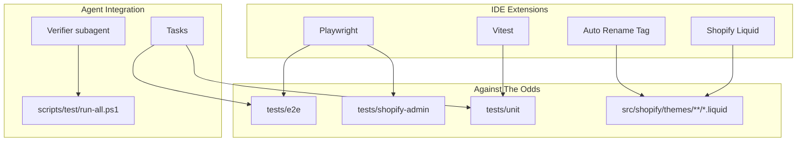

# Extensions Setup and Utilization Plan (Guru-Improved)

## References

- [CURSOR_AND_AGENT_OPTIMIZATION.md](../../docs/status/CURSOR_AND_AGENT_OPTIMIZATION.md) — extensions alignment
- [GURU_EXTENSIONS_CONFIG_AUDIT_20260207.md](../../docs/status/GURU_EXTENSIONS_CONFIG_AUDIT_20260207.md) — guru config audit
- [node-and-automation.md](../context/node-and-automation.md) — Playwright/Vitest context
- [agentic-performance SKILL](../skills/agentic-performance/SKILL.md) — plan-first, verifiable goals

---

## Current State

The project recommends these extensions in [.cursor/extensions.json](../extensions.json):

- **Playwright** (`ms-playwright.playwright`) — present
- **Vitest** (`vitest.explorer`) — present
- **Auto Rename Tag** (`formulahendry.auto-rename-tag`) — present
- **Shopify Theme Check** (`shopify.theme-check-vscode`) — present (display name "Shopify Liquid"; same extension)
- **XML Tools** (`DotJoshJohnson.xml`) — not recommended; add if XML feeds/sitemaps needed

**Critical**: The Shopify Liquid extension activates on `workspaceContains:**/.theme-check.yml`. Creating `.theme-check.yml` is required for Theme Check diagnostics.

---

## Phase 1: Prerequisites and Installation

### 1.1 Prerequisites

| Dependency          | Purpose                                                     | Verify                              |
| ------------------- | ----------------------------------------------------------- | ----------------------------------- |
| Node.js 20          | npm, Vitest, Playwright                                     | `node -v`                           |
| Python 3            | Playwright webServer (`python -m http.server 8080`) for E2E | `python --version`                  |
| Shopify CLI         | `shopify theme check` for Theme Check CLI                   | `shopify version`                   |
| Playwright browsers | E2E tests                                                   | `npx playwright install` (one-time) |

### 1.2 Extension Verification

| Extension       | ID                              | Verification                                                                       |
| --------------- | ------------------------------- | ---------------------------------------------------------------------------------- |
| Playwright Test | `ms-playwright.playwright`      | Testing sidebar → Playwright section; Command Palette → "Test: Install Playwright" |
| Vitest          | `vitest.explorer`               | Testing sidebar → Vitest tests; run icon on `tests/unit/*.test.js`                 |
| Auto Rename Tag | `formulahendry.auto-rename-tag` | Rename `<div>` in Liquid/HTML; closing tag auto-updates                            |
| Shopify Liquid  | `shopify.theme-check-vscode`    | Open `.liquid` → syntax, completions, Problems; **requires .theme-check.yml**      |
| XML Tools       | `DotJoshJohnson.xml`            | Optional; add to extensions.json if needed                                         |

**Optional**: Add `DotJoshJohnson.xml` to [.cursor/extensions.json](../extensions.json) and [.vscode/extensions.json](../../.vscode/extensions.json).

---

## Phase 2: Per-Extension Configuration

### 2.1 Playwright Test

**Official settings** (from microsoft/playwright-vscode):

| Setting                                 | Type    | Default   | Recommendation                                                     |
| --------------------------------------- | ------- | --------- | ------------------------------------------------------------------ |
| `playwright.reuseBrowser`               | boolean | false     | `true` — faster iterative runs                                     |
| `playwright.showTrace`                  | boolean | false     | `true` — trace viewer on failure                                   |
| `playwright.env`                        | object  | {}        | Set `SHOPIFY_STORE_URL`, `SHOPIFY_STORE_DOMAIN` for Shopify config |
| `playwright.pickLocatorCopyToClipboard` | boolean | false     | `true` — copy locator when using Pick Locator                      |
| `playwright.updateSnapshots`            | string  | "missing" | Keep default                                                       |

**Config switching**: Use gear icon in Playwright sidebar to switch between `playwright.config.js` (static E2E) and `playwright.shopify.config.js` (admin/store).

**Best-practice workflow**:

1. Run single test: click play icon in Testing sidebar
2. Show Browser: enable for live debugging
3. Trace Viewer: enable for flaky/debug runs
4. CodeGen: "Record new" or "Record at cursor" for new tests
5. Pick locator: hover elements for resilient locators (`page.getByRole(...)`)

**Environment**: If config depends on env vars, use `playwright.env` or `.env` so extension discovers tests.

### 2.2 Vitest

**Key settings** (from vitest-dev/vscode):

| Setting                       | Type    | Recommendation                                          |
| ----------------------------- | ------- | ------------------------------------------------------- |
| `vitest.enable`               | boolean | `true` (default)                                        |
| `vitest.commandLine`          | string  | `npm run test:unit`                                     |
| `vitest.applyDiagnostic`      | boolean | `true` — squiggles in editor                            |
| `vitest.showInlineConsoleLog` | boolean | `true` — inline console output                          |
| `vitest.include`              | string  | `tests/**/*.test.{js,ts}` (if extension ignores config) |
| `vitest.exclude`              | string  | `tests/e2e/`**, `tests/shopify-admin/**`                |

**Coverage**: Vitest config already has `coverage.provider: 'v8'`. Use Testing sidebar → "Run Tests with Coverage" (VS Code 1.88+). Or run `npm run test:coverage` and open `coverage/index.html`.

**Best-practice workflow**:

1. Run from sidebar: file/suite/test level
2. Watch: `npm run test` in terminal
3. Coverage: sidebar "Run Tests with Coverage" or `npm run test:coverage`

### 2.3 Auto Rename Tag

**Settings**:

| Setting                                | Type  | Recommendation                                                                                    |
| -------------------------------------- | ----- | ------------------------------------------------------------------------------------------------- |
| `auto-rename-tag.activationOnLanguage` | array | `["html", "liquid", "xml", "javascript", "javascriptreact"]` — explicit activation for theme work |

**Note**: VS Code `editor.linkedEditing` (HTML/Handlebars) can override; Liquid uses `liquid` language ID, so Auto Rename Tag applies.

**Workflow**: Edit tags in [ao-hero.liquid](../../src/shopify/themes/aodrop-theme/sections/ao-hero.liquid); closing tag auto-updates.

### 2.4 Shopify Liquid (Theme Check)

**Extension activation**: Requires `workspaceContains:**/.theme-check.yml`. Create this file first.

**Extension settings** (from theme-check-vscode):

| Setting                               | Type    | Default | Recommendation                        |
| ------------------------------------- | ------- | ------- | ------------------------------------- |
| `themeCheck.checkOnOpen`              | boolean | true    | Keep                                  |
| `themeCheck.checkOnChange`            | boolean | true    | Keep                                  |
| `themeCheck.checkOnSave`              | boolean | true    | Keep                                  |
| `themeCheck.onlySingleFileChecks`     | boolean | false   | `false` for full theme checks         |
| `shopifyLiquid.disableWindowsWarning` | boolean | false   | `true` on Windows to suppress warning |

**Commands**: `shopifyLiquid.restart`, `shopifyLiquid.runChecks` (Command Palette).

`**.theme-check.yml`\*\* (create at repo root):

```yaml
root: src/shopify/themes/aodrop-theme
extends:
  - theme-check:recommended
ignore:
  - 'node_modules/**'
```

**Presets**: `theme-check:recommended` (curated), `theme-check:all` (all checks), `theme-check:theme-app-extension`.

**CLI**: Run `shopify theme check --path=src/shopify/themes/aodrop-theme` (requires Shopify CLI).

### 2.5 XML Tools (optional)

| Setting                      | Recommendation |
| ---------------------------- | -------------- |
| `xmlTools.enableXmlTreeView` | `true`         |

**Use case**: Sitemaps, product feeds, future XML integrations.

---

## Phase 3: Workspace Settings ( Consolidated )

Add to [.cursor/settings.json](../settings.json):

```json
{
  "playwright.reuseBrowser": true,
  "playwright.showTrace": true,
  "playwright.pickLocatorCopyToClipboard": true,
  "playwright.env": {
    "SHOPIFY_STORE_DOMAIN": "aodrop.com"
  },
  "vitest.enable": true,
  "vitest.commandLine": "npm run test:unit",
  "vitest.include": "tests/**/*.test.{js,ts}",
  "vitest.exclude": "tests/e2e/**",
  "auto-rename-tag.activationOnLanguage": [
    "html",
    "liquid",
    "xml",
    "javascript",
    "javascriptreact"
  ],
  "themeCheck.checkOnOpen": true,
  "themeCheck.checkOnChange": true,
  "themeCheck.checkOnSave": true,
  "shopifyLiquid.disableWindowsWarning": true
}
```

**Note**: `playwright.env` values can be overridden by `.env.local` when scripts run; use for extension test discovery.

---

## Phase 4: Cursor Tasks and Shortcuts

**Add to [.cursor/tasks.json](../tasks.json)**:

| Label                                | Command                                                                        | Purpose          |
| ------------------------------------ | ------------------------------------------------------------------------------ | ---------------- |
| Playwright: Install Browsers         | `npx playwright install`                                                       | One-time/refresh |
| Vitest: Run with Coverage            | `npm run test:coverage`                                                        | Coverage report  |
| Vitest: Watch                        | `npm run test`                                                                 | Watch mode       |
| Run All Tests (unit+integration+e2e) | `powershell -NoProfile -ExecutionPolicy Bypass -File scripts/test/run-all.ps1` | Full test suite  |
| Theme Check (CLI)                    | `shopify theme check --path=src/shopify/themes/aodrop-theme`                   | Validate theme   |

**Existing**: "Run E2E Tests", "Run Shopify E2E Tests", "Run Tests" already present.

---

## Phase 5: Agentic Integration

### 5.1 Verifier Subagent

Extend [.cursor/agents/verifier.md](../agents/verifier.md) to run:

1. `npm run test:unit` (Vitest)
2. `npm run test:e2e` (Playwright default) when E2E-related files changed
3. `npm run test:shopify` (Playwright Shopify) when `src/shopify/`** or `tests/shopify-admin/**` changed

### 5.2 Scripts for Agents

| Script                                 | Purpose                                                                                                |
| -------------------------------------- | ------------------------------------------------------------------------------------------------------ |
| `scripts/test/test-all-extensions.ps1` | Run unit + e2e + shopify; report pass/fail (or extend `scripts/test/run-all.ps1` with `-Shopify` flag) |
| `scripts/shopify/theme-check.ps1`      | Run `shopify theme check` on aodrop-theme; exit code for CI/agents                                     |
| Extend `scripts/verify-pipeline.ps1`   | Optional: add Theme Check step when theme files changed                                                |

### 5.3 /review Command

[.cursor/commands/review/COMMAND.md](../commands/review/COMMAND.md) already runs lint, format, tests. Ensure it invokes `npm run test` (or `test:unit` for speed). No change needed if it uses `npm test` / `npm run test`.

### 5.4 Context Updates

Add to [.cursor/context/node-and-automation.md](../context/node-and-automation.md):

- **Extensions**: Playwright and Vitest appear in Testing sidebar; use CodeGen for new E2E tests; enable Trace Viewer for debugging.
- **Theme Check**: Create `.theme-check.yml` for Shopify Liquid extension; run `shopify theme check` for CLI validation.

---

## Phase 6: Documentation

1. **[docs/status/CURSOR_AND_AGENT_OPTIMIZATION.md](../../docs/status/CURSOR_AND_AGENT_OPTIMIZATION.md)**: Add "Extensions in-depth" section with per-extension setup, settings, and workflows.
2. **[docs/AGENT_WORKFLOW_CURSOR_SHOPIFY.md](../../docs/AGENT_WORKFLOW_CURSOR_SHOPIFY.md)**: Note Theme Check and Liquid extension for theme edits (Theme flow step 2).
3. **Theme README** (if exists): Mention Theme Check and `.theme-check.yml`.

---

## Phase 7: Verification Checklist

1. Open Testing sidebar; see Playwright and Vitest tests.
2. Run single Vitest test from sidebar; passes.
3. Run single Playwright test from sidebar; passes (webServer or baseURL valid).
4. Open `ao-hero.liquid`; rename `<section>` to `<div>`; closing tag auto-updates.
5. Open Liquid file; Problems panel shows Theme Check output (after .theme-check.yml exists).
6. Run `.\scripts\test\run-all.ps1`; unit + integration + e2e pass (or skip integration if no creds).
7. Run `.\scripts\shopify\theme-check.ps1` (or `shopify theme check`); reports or passes.
8. Verifier subagent runs unit + e2e; reports correctly.

---

## Architecture Overview



---

## Files to Create/Modify

| File                                                                                               | Action                                                              |
| -------------------------------------------------------------------------------------------------- | ------------------------------------------------------------------- |
| [.cursor/settings.json](../settings.json)                                                          | Add Playwright, Vitest, Auto Rename Tag, Theme Check settings       |
| [.cursor/extensions.json](../extensions.json)                                                      | Optionally add DotJoshJohnson.xml                                   |
| [.cursor/tasks.json](../tasks.json)                                                                | Add Playwright install, Vitest coverage, Run All Tests, Theme Check |
| `.theme-check.yml`                                                                                 | Create at repo root (required for Shopify Liquid activation)        |
| [.cursor/agents/verifier.md](../agents/verifier.md)                                                | Extend with conditional test commands                               |
| `scripts/test/test-all-extensions.ps1` or extend `run-all.ps1`                                     | Add -Shopify flag; optional theme-check step                        |
| `scripts/shopify/theme-check.ps1`                                                                  | Create — run shopify theme check                                    |
| [.cursor/context/node-and-automation.md](../context/node-and-automation.md)                        | Add extension usage note                                            |
| [docs/status/CURSOR_AND_AGENT_OPTIMIZATION.md](../../docs/status/CURSOR_AND_AGENT_OPTIMIZATION.md) | Add Extensions in-depth section                                     |
| [.vscode/extensions.json](../../.vscode/extensions.json)                                           | Create if missing; mirror .cursor                                   |
| [.vscode/settings.json](../../.vscode/settings.json)                                               | Create if missing; mirror .cursor (omit cursor.\* keys)             |

---

## Execution Order

1. Verify prerequisites (Node, Python, Shopify CLI, `npx playwright install`).
2. Verify extensions installed; add XML Tools to extensions.json if desired.
3. Create `.theme-check.yml` at repo root (enables Shopify Liquid extension).
4. Update .cursor/settings.json with extension settings.
5. Add new tasks to .cursor/tasks.json.
6. Create scripts/shopify/theme-check.ps1; extend run-all.ps1 if needed.
7. Update verifier agent.
8. Update documentation.
9. Run verification checklist.

---

## CI Alignment

CI ([.github/workflows/ci.yml](../../.github/workflows/ci.yml)) runs `test:unit` only. E2E and Shopify tests run locally or in dedicated workflows. Theme Check is not in CI; add optionally via `shopify theme check` when theme files change.
