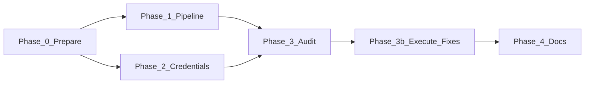

# Guru Full-System Setup and Automation Plan

This plan covers prepare-to-build (Phase 0) and four execution phases. Execution follows the Prodigy Protocol (PP) baseline: purpose embedding, task trees, verification at each stage, and continuous audit.

---

## Custom-tailored guru expert team (for this plan)

| Role                 | Scope                                             | PP cycle focus                                                                                                                             |
| -------------------- | ------------------------------------------------- | ------------------------------------------------------------------------------------------------------------------------------------------ |
| **Pipeline guru**    | CI, verify-pipeline, workflows, quality gates     | Research CI vs verify-pipeline gaps; audit workflow YAML and required secrets; recommend optional CI job or doc-only.                      |
| **Credentials guru** | .env.local, browser/client-cred flows, full-setup | Audit auto-configure-env, get-access-token, save-token-to-env, verify-credentials; document method matrix; design full-setup orchestrator. |
| **Audit guru**       | Repo-wide scripts, inventories, configs, refs     | Run parse-all-ps1, lint, test; audit scripts/README vs actual scripts; hardcoded paths; inventories (BRANCH, ENVIRONMENTS, INDEX_REPORTS). |
| **Docs/PP guru**     | OPERATOR_RUNBOOK, AGENTS.md, skills, handoff      | Audit runbook completeness; PP/skills references; handoff chain; recommend GURU_PP_OPERATOR_GUIDE content.                                 |

**Reference**: The repo’s full guru matrix (Phase 0 + Tracks A–G) is in [docs/status/GURU_TEAM_ASSIGNMENTS.md](docs/status/GURU_TEAM_ASSIGNMENTS.md) and [docs/status/AUDIT_AND_PERFECTION_FRAMEWORK.md](docs/status/AUDIT_AND_PERFECTION_FRAMEWORK.md). This plan uses a reduced team above for the four initiatives only.

---

## Phase 0: Prepare to build — PP research and guru-expert audits

**Goal**: Perform in-depth, comprehensive, multifaceted PP cycles of research, auditing, review, and analysis so the plan and repo are ready to build. Fix all existing issues in the plan document and capture repo issues for Phase 3.

### 0.1 Plan document fixes (applied)

- **Current state link**: Credentials source is `.env.local` (from [.env.example](.env.example)); fixed link text.
- **Grammar**: "Add an **optional**" (not "Add a optional").
- **Execution order**: Phase 0 runs first; Phase 1 and 2 can run in parallel after 0; Phase 3 after 1 and 2; Phase 3b then Phase 4.
- **Hardcoded paths**: Many scripts set `$repoPath = "C:\Users\LegiT\against-the-odds"` (see [scripts/shared/utilities.ps1](scripts/shared/utilities.ps1) for the correct pattern: derive from `$PSScriptRoot` or use `Set-RepoLocation`). Affected scripts include: auto-configure-env.ps1, setup-env.ps1, update-dependencies.ps1, run-all.ps1, sync-from-github.ps1, get-theme-id.ps1, check-app-installation.ps1, verify-auth.ps1, verify-secrets.ps1, test-push-pull.ps1, optimize-repo.ps1, and others under scripts/ (grep for `$repoPath = "C:\\`). **P0 fix**: Replace with repo-root resolution from `$PSScriptRoot` (see verify-pipeline.ps1 or utilities.ps1).

### 0.2 Guru-expert PP cycles (read-only)

1. **Pipeline guru**: Review [scripts/verify-pipeline.ps1](scripts/verify-pipeline.ps1), [.github/workflows/ci.yml](.github/workflows/ci.yml), [.github/workflows/README.md](.github/workflows/README.md). Confirm workflow list (ci, codeql, shopify-sync, sync-theme-branch, sync, maintenance). Note: full verify-pipeline (runbook, product sync dry-run) is local-only; CI runs lint, format check, unit tests, Trivy, secret-scan, npm audit.
2. **Credentials guru**: Review [scripts/setup/auto-configure-env.ps1](scripts/setup/auto-configure-env.ps1) (hardcoded path line 10), [docs/CREDENTIALS_SETUP.md](docs/CREDENTIALS_SETUP.md), [docs/BROWSER_CREDENTIAL_FLOW.md](docs/BROWSER_CREDENTIAL_FLOW.md), browser scripts. List required vars and which method (browser vs client-credentials vs manual) applies.
3. **Audit guru**: Run (when executing) parse-all-ps1, lint, test:unit; compare [scripts/README.md](scripts/README.md) to actual scripts; list scripts with hardcoded paths; spot-check [docs/status/INDEX_REPORTS.md](docs/status/INDEX_REPORTS.md), [docs/status/ENVIRONMENTS_AND_SECRETS_INVENTORY.md](docs/status/ENVIRONMENTS_AND_SECRETS_INVENTORY.md).
4. **Docs/PP guru**: Review [OPERATOR_RUNBOOK.md](OPERATOR_RUNBOOK.md), [AGENTS.md](AGENTS.md), [.cursor/skills/prodigy-protocol/SKILL.md](.cursor/skills/prodigy-protocol/SKILL.md). Identify missing "For AI agents" and guru/PP execution summary.

### 0.3 Deliverables (Phase 0)

- This plan updated with Phase 0, guru team, and plan fixes.
- Findings from 0.2 recorded in FIX_AND_PERFECT_PLAN (Phase 3) or in a short audit note (e.g. in CONSOLIDATION_LOG or plan appendix).
- **Build readiness**: After Phase 0, the plan is fixed and the repo’s known issues (hardcoded paths, doc gaps) are captured; Phases 1–4 can execute.

---

## Current state (summary)

- **Pipeline**: [scripts/verify-pipeline.ps1](scripts/verify-pipeline.ps1) runs 5 steps (parse PS1, workflow files, product sync dry-run, lint, runbook). CI ([.github/workflows/ci.yml](.github/workflows/ci.yml)) runs lint, format check, unit tests, Trivy, secret-scan, npm audit; runbook is local-only.
- **Credentials**: `.env.local` (from [.env.example](.env.example)); browser scripts ([get-access-token.ps1](scripts/shopify/browser/get-access-token.ps1), [get-theme-id.ps1](scripts/shopify/browser/get-theme-id.ps1), [save-token-to-env.ps1](scripts/shopify/browser/save-token-to-env.ps1)); client-credentials ([get-token-client-credentials.ps1](scripts/shopify/browser/get-token-client-credentials.ps1)); [auto-configure-env.ps1](scripts/setup/auto-configure-env.ps1) and [verify-credentials.ps1](scripts/setup/verify-credentials.ps1). Docs: [CREDENTIALS_SETUP.md](docs/CREDENTIALS_SETUP.md), [BROWSER_CREDENTIAL_FLOW.md](docs/BROWSER_CREDENTIAL_FLOW.md).
- **Audit framework**: [AUDIT_AND_PERFECTION_FRAMEWORK.md](docs/status/AUDIT_AND_PERFECTION_FRAMEWORK.md) and [FINAL_REPO_ORGANIZATION_AND_AUDIT.plan.md](.cursor/plans/FINAL_REPO_ORGANIZATION_AND_AUDIT.plan.md) define Phase 0 + Tracks A–G; [GURU_TEAM_ASSIGNMENTS.md](docs/status/GURU_TEAM_ASSIGNMENTS.md) exists. Main automated checks: [verify-pipeline.ps1](scripts/verify-pipeline.ps1), [parse-all-ps1.ps1](scripts/debug/parse-all-ps1.ps1).
- **Guru/PP**: [.cursor/skills/prodigy-protocol/SKILL.md](.cursor/skills/prodigy-protocol/SKILL.md), [.cursor/rules/pp-basis.mdc](.cursor/rules/pp-basis.mdc), [OPERATOR_RUNBOOK.md](OPERATOR_RUNBOOK.md), [AGENTS.md](AGENTS.md).

---

## Phase 1: Pipeline automations — integrate and expand

**Goal**: Align CI with verify-pipeline, add optional quality gates, and document required status checks.

1. **CI vs verify-pipeline alignment**
   - CI already runs: format check, lint, unit tests, Trivy, secret-scan, npm audit (and optional Lighthouse). verify-pipeline adds: (1) parse-all-ps1, (2) workflow file existence, (3) product sync dry-run (credential-gated), (5) run-runbook (credential-gated).
   - Add an **optional** CI job (e.g. `verify-pipeline`) that runs on Windows runner and executes `scripts/verify-pipeline.ps1 -SkipRunbook` (parse + workflow check only; skip runbook and sync dry-run in CI unless secrets are provided). Or: document in [.github/workflows/README.md](.github/workflows/README.md) that "full verify-pipeline (including runbook) is local-only; CI runs lint/test/security only."

2. **Quality gates**
   - [package.json](package.json) already has `quality`: `format && format:check && lint && test:unit` (see [OPERATOR_RUNBOOK.md](OPERATOR_RUNBOOK.md)).
   - Add to OPERATOR_RUNBOOK or [docs/guides/WORKFLOW_PIPELINE_VISUAL_GUIDE.md](docs/guides/WORKFLOW_PIPELINE_VISUAL_GUIDE.md): "Before push: run `.\scripts\verify-pipeline.ps1` (or `-SkipRunbook` if no .env.local)."

3. **Branch protection and status checks**
   - If [scripts/github/update-branch-protection-status-checks.js](scripts/github/update-branch-protection-status-checks.js) is used, ensure it lists actual CI job names (e.g. `test`, `security`).

**Deliverables**: CI job (optional) or clear doc that verify-pipeline is local; OPERATOR_RUNBOOK/visual guide updated; branch-protection script verified or documented.

---

## Phase 2: Full automated credential and setup flow

**Goal**: Single entry point that ensures .env.local, guides missing vars, runs guru-approved credential methods (browser, client-credentials, e2e/screen-read/PC-control where applicable), and verifies.

1. **Single "full setup" orchestrator**
   - Create or extend a script (e.g. [scripts/setup/auto-configure-env.ps1](scripts/setup/auto-configure-env.ps1) or new `scripts/setup/full-setup.ps1`) that:
     - Ensures `.env.local` exists (from `.env.example`).
     - For each required credential (SHOPIFY_STORE_DOMAIN, SHOPIFY_ACCESS_TOKEN, SHOPIFY_THEME_ID, GITHUB_TOKEN as needed): if missing or placeholder, prompt or invoke the appropriate method.
     - **Shopify token**: Prefer client-credentials if SHOPIFY_API_KEY + SHOPIFY_API_SECRET exist; else browser flow (get-access-token.ps1 / save-token-to-env.ps1) with clear instructions ("log in when asked").
     - **Theme ID**: Run get-theme-id.ps1 (browser) or document manual step.
     - **GitHub**: Document link to create token; optional automated fetch only if e2e/screen-read is added.
   - Call [verify-credentials.ps1](scripts/setup/verify-credentials.ps1) at the end; optionally [run-runbook.ps1](scripts/run-runbook.ps1).
   - **Fix**: Use repo-root resolution from `$PSScriptRoot` (no hardcoded path).

2. **Guru-approved methods (documented and wired)**
   - **Browser (existing)**: [BROWSER_CREDENTIAL_FLOW.md](docs/BROWSER_CREDENTIAL_FLOW.md) and scripts under [scripts/shopify/browser/](scripts/shopify/browser/).
   - **Client credentials**: [get-token-client-credentials.ps1](scripts/shopify/browser/get-token-client-credentials.ps1); full-setup calls it when API key/secret present.
   - **E2E / screen-read / PC control**: Document as future options in CREDENTIALS_SETUP.md or CREDENTIAL_SETUP_STEPS.md; implement only if scope agreed.

3. **Runbook and verify-pipeline**
   - Full-setup ends with "Run .\scripts\run-runbook.ps1 to verify."

**Deliverables**: One orchestrator script (full-setup or extended auto-configure-env) with portable repo path; CREDENTIALS_SETUP.md (or CREDENTIAL_SETUP_STEPS.md) updated with method matrix; verification step documented.

---

## Phase 3: Audit entire repo and produce fix-and-perfect plan

**Goal**: One systematic audit pass and a single prioritized fix-and-perfect plan (then execute it in Phase 3b).

1. **Audit execution (using existing framework)**
   - **Automated**: Run [scripts/verify-pipeline.ps1](scripts/verify-pipeline.ps1) (or -SkipRunbook), [scripts/debug/parse-all-ps1.ps1](scripts/debug/parse-all-ps1.ps1), `npm run lint`, `npm run test:unit`, and optionally [scripts/run-everything-debug.ps1](scripts/run-everything-debug.ps1). Record failures and gaps.
   - **Inventories**: Refresh or confirm [docs/status/BRANCH_INVENTORY.md](docs/status/BRANCH_INVENTORY.md), [docs/status/ENVIRONMENTS_AND_SECRETS_INVENTORY.md](docs/status/ENVIRONMENTS_AND_SECRETS_INVENTORY.md), [docs/status/INDEX_REPORTS.md](docs/status/INDEX_REPORTS.md).
   - **Workflows**: Validate all YAML under [.github/workflows/](.github/workflows/); required secrets documented in [docs/knowledge-base/github-workflows.md](docs/knowledge-base/github-workflows.md).
   - **Scripts**: Ensure [scripts/README.md](scripts/README.md) lists all scripts; document run-from-root requirement where needed.
   - **Hardcoded paths**: P0 — replace `$repoPath = "C:\Users\LegiT\against-the-odds"` (and similar) with derivation from `$PSScriptRoot` in all scripts (pattern in [scripts/shared/utilities.ps1](scripts/shared/utilities.ps1) or [scripts/verify-pipeline.ps1](scripts/verify-pipeline.ps1)).
   - **Config**: ESLint, Prettier, Vitest, Playwright configs present and used by npm scripts; .cursor/rules and .cursor/context referenced in AGENTS.md.

2. **Produce fix-and-perfect plan**
   - Single document (e.g. `docs/status/FIX_AND_PERFECT_PLAN_YYYYMMDD.md` or section in CONSOLIDATION_LOG) with:
     - **Findings**: Parse failures, lint/test failures, missing workflows, outdated inventories, broken refs, missing docs, **hardcoded repo paths**.
     - **Prioritized list**: P0 (blocking: parse, lint, tests, secrets doc, **hardcoded paths**), P1 (runbook/operator doc, pipeline alignment), P2 (inventories, optional e2e/credential automation).
   - Each item: 1–2 sentence fix; owner; optional track (Phase 0 / A–G) per [AUDIT_AND_PERFECTION_FRAMEWORK.md](docs/status/AUDIT_AND_PERFECTION_FRAMEWORK.md).

3. **Execute the plan (Phase 3b)**
   - Fix P0 items (script parse errors, lint, test, workflow syntax, secret documentation, **hardcoded repo paths in all affected scripts**).
   - Fix P1 items (runbook clarity, pipeline doc, OPERATOR_RUNBOOK alignment with verify-pipeline).
   - P2 as time permits.

**Deliverables**: Audit log; FIX_AND_PERFECT_PLAN document; P0 and P1 fixes applied; CONSOLIDATION_LOG entry.

---

## Phase 4: Document and codify guru/PP and operator runbook

**Goal**: One place agents and operators look for "how to execute like the guru team" and "what to run when."

1. **Guru/PP execution guide**
   - Create [docs/GURU_PP_OPERATOR_GUIDE.md](docs/GURU_PP_OPERATOR_GUIDE.md) (or extend [AGENTS.md](AGENTS.md)) that:
     - References [.cursor/skills/prodigy-protocol/SKILL.md](.cursor/skills/prodigy-protocol/SKILL.md) as the execution baseline (purpose embedding, task trees, audit loop, failure resilience).
     - References [.cursor/skills/agentic-performance/SKILL.md](.cursor/skills/agentic-performance/SKILL.md) for plan-first execution and worktrees.
     - States when to use which skill (pp for high-reliability tasks; agentic-performance for optimization/worktrees; universal-godmode when user demands exact structure).
     - Describes the multi-cycle research approach: "Deep-research backed setups; multiple PP cycles for research, best practices, systems; trusted, up-to-date, logical decisions; then implement, optimize, perfect."
   - Add a short "For AI agents" section in [OPERATOR_RUNBOOK.md](OPERATOR_RUNBOOK.md) that points to this guide and to verify-pipeline/runbook as the daily gates.

2. **Operator runbook completeness**
   - OPERATOR_RUNBOOK includes: daily checks (npm run quality, verify-pipeline when needed); integration checks (run-runbook); credential setup pointer (CREDENTIALS_SETUP.md, BROWSER_CREDENTIAL_FLOW.md); troubleshooting (Git proxy, Shopify 401); link to pipeline visual guide and to the guru/PP guide.
   - Optional: "Full system setup" subsection pointing to the Phase 2 orchestrator script.

3. **Handoff and consolidation**
   - [docs/status/HANDOFF_FOR_NEW_AGENT_202602.md](docs/status/HANDOFF_FOR_NEW_AGENT_202602.md) or [docs/HANDOFF_PROMPT_NEW_AGENT.md](docs/HANDOFF_PROMPT_NEW_AGENT.md) references the guru/PP guide and OPERATOR_RUNBOOK.
   - Append CONSOLIDATION_LOG entry for "Guru full-system setup and automation plan execution" with date and summary of Phases 0–4.

**Deliverables**: GURU_PP_OPERATOR_GUIDE.md (or AGENTS.md extension); OPERATOR_RUNBOOK "For AI agents" + optional "Full system setup"; handoff doc updated; CONSOLIDATION_LOG entry.

---

## Execution order and dependencies

- **Phase 0** runs first: plan fixes and guru PP cycles (research/audit); produces findings and build readiness.
- **Phase 1 and 2** can run in parallel after Phase 0.
- **Phase 3** (audit) runs after P1 and P2; **Phase 3b** (fixes) follows the produced FIX_AND_PERFECT_PLAN.
- **Phase 4** runs after P3b so the operator guide and runbook reflect the final pipeline and setup flow.

---

## Risks and mitigations

- **Credentials in CI**: No Shopify/GitHub secrets in workflow YAML; optional verify-pipeline job in CI must skip runbook and credential-dependent steps (document "local-only" for full runbook).
- **E2E/screen-read/PC control**: Approved as methods; document as future options; implement one only if scope is agreed.
- **Audit scope creep**: Stick to P0 → P1 → P2; defer "perfect everything" to follow-up cycles.
- **Hardcoded paths**: Many scripts; fix in batch using shared pattern (utilities.ps1 or verify-pipeline.ps1) to avoid worktree/CI breakage.

---

## Summary

| Phase  | Focus             | Key deliverables                                                                                          |
| ------ | ----------------- | --------------------------------------------------------------------------------------------------------- |
| 0      | Prepare to build  | Plan fixes; guru PP cycles (research/audit); findings; build readiness                                    |
| 1      | Pipeline          | CI alignment or doc; quality gates; branch-protection check                                               |
| 2      | Credentials       | Full-setup orchestrator (portable path); method matrix doc; optional e2e/screen-read/PC-control as future |
| 3 + 3b | Audit + fix       | Audit run; FIX_AND_PERFECT_PLAN; P0 (incl. hardcoded paths) and P1 fixes applied                          |
| 4      | Guru/PP + runbook | GURU_PP_OPERATOR_GUIDE; OPERATOR_RUNBOOK "For AI agents"; handoff updated; CONSOLIDATION_LOG              |

All phases execute in order after Phase 0; each phase is verified before the next (PP audit loop).
