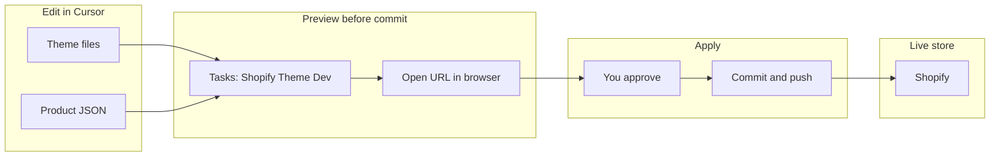
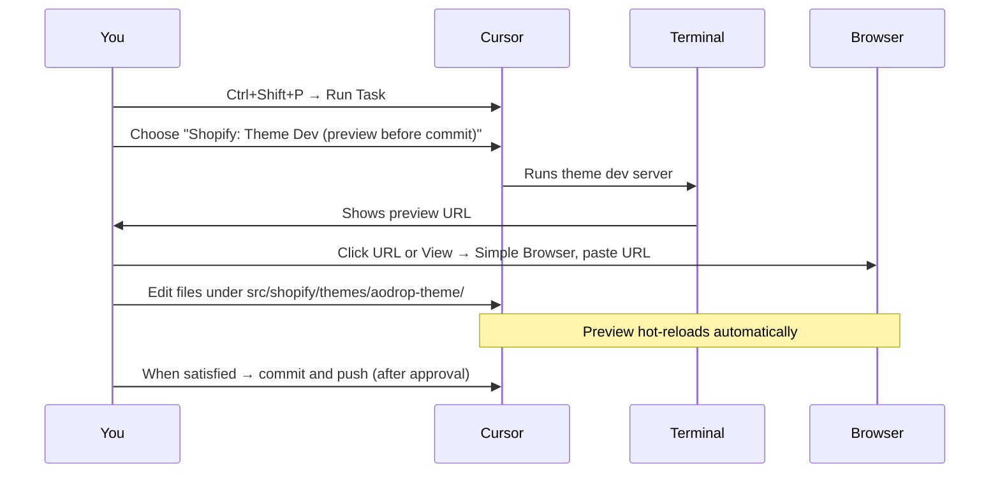
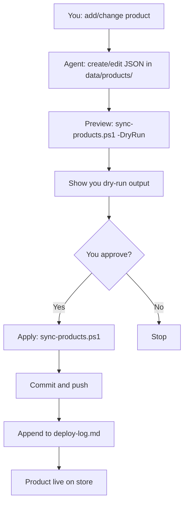
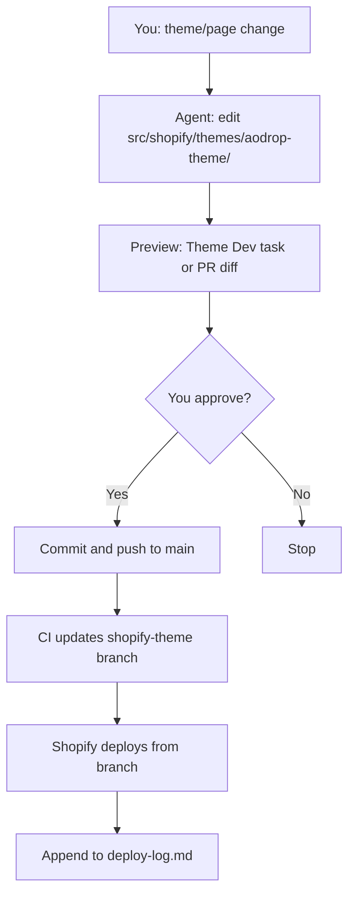
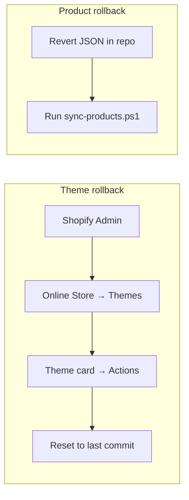
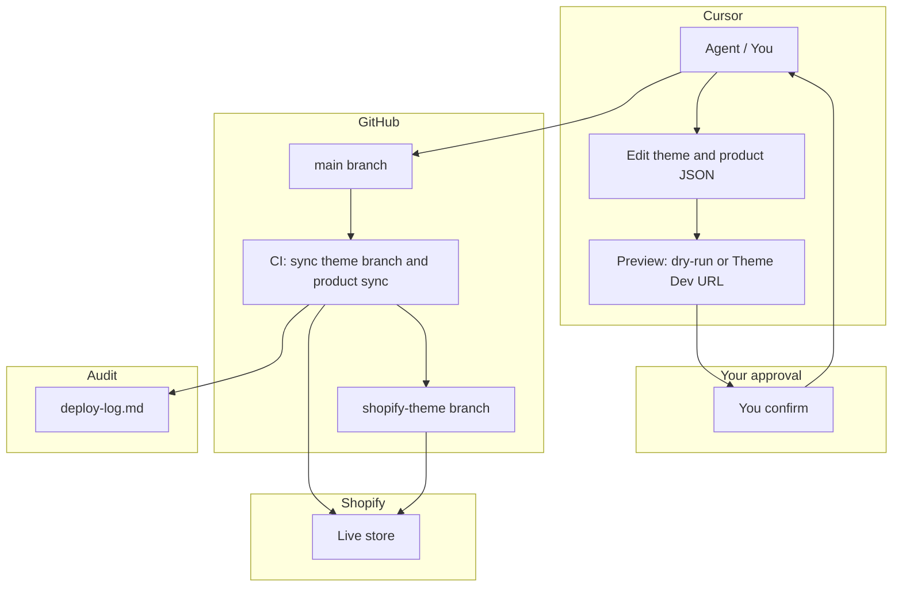

# Cursor → GitHub → Shopify: Visual Usage Guide

**Against The Odds (AO) store** — Edit in Cursor, preview live, push to GitHub, store updates.

---

## At a glance

---

## 1. Preview your theme before committing (see work live)

**Goal:** See Shopify theme changes in the browser without committing.

| Step | Action                                                                                   |
| ---- | ---------------------------------------------------------------------------------------- |
| 1    | In Cursor: **Ctrl+Shift+P** (Mac: **Cmd+Shift+P**) → type **Run Task**                   |
| 2    | Select **Shopify: Theme Dev (preview before commit)**                                    |
| 3    | Wait for the preview URL in the terminal (e.g. `https://...` or `http://127.0.0.1:9292`) |
| 4    | **Click the URL** in the terminal, or **View → Simple Browser** and paste the URL        |
| 5    | Edit theme files; the preview updates live. No commit needed to preview.                 |

**One-time:** If the theme folder is empty, run `.\scripts\shopify\theme-pull.ps1` first (requires Shopify CLI and `shopify auth login`).

---

## 2. Product listing flow (add or change a product)

**Goal:** Add or update a product on the store from Cursor.

| Step | Action                                                                                 |
| ---- | -------------------------------------------------------------------------------------- |
| 1    | Ask in Cursor (e.g. "list this product on my page")                                    |
| 2    | Agent creates/edits JSON in `data/products/` (see `data/products/example-hoodie.json`) |
| 3    | **Preview:** Agent runs `.\scripts\shopify\sync-products.ps1 -DryRun` and shows output |
| 4    | **Approve:** You confirm (e.g. "yes", "apply")                                         |
| 5    | **Apply:** Agent runs sync without `-DryRun`, then commit and push                     |
| 6    | **Log:** Agent appends entry to `docs/status/deploy-log.md`                            |

---

## 3. Theme / page flow (change store pages)

**Goal:** Change theme or pages; preview, then go live.

| Step | Action                                                                            |
| ---- | --------------------------------------------------------------------------------- |
| 1    | Ask in Cursor for theme or page changes                                           |
| 2    | Agent edits files under `src/shopify/themes/aodrop-theme/`                        |
| 3    | **Preview:** Run **Tasks → Shopify: Theme Dev** and open URL, or review PR diff   |
| 4    | **Approve:** You confirm                                                          |
| 5    | **Apply:** Commit and push to `main`; CI updates `shopify-theme`; Shopify deploys |
| 6    | **Log:** Append to `docs/status/deploy-log.md`                                    |

---

## 4. Rollback

| What         | How                                                                                                                                           |
| ------------ | --------------------------------------------------------------------------------------------------------------------------------------------- |
| **Theme**    | Shopify Admin → Online Store → Themes → on theme card → **Actions** → **Reset to last commit**. Or revert commit on `shopify-theme` and push. |
| **Products** | Revert `data/products/*.json` in repo and run `.\scripts\shopify\sync-products.ps1`; or fix in Shopify Admin.                                 |

---

## 5. Quick reference

| Goal                              | Command or action                                                                  |
| --------------------------------- | ---------------------------------------------------------------------------------- |
| **Theme preview (before commit)** | **Tasks** → **Shopify: Theme Dev** → open URL in terminal or View → Simple Browser |
| Product sync (preview)            | `.\scripts\shopify\sync-products.ps1 -DryRun`                                      |
| Product sync (apply)              | `.\scripts\shopify\sync-products.ps1`                                              |
| Theme dev (terminal)              | `.\scripts\shopify\theme-dev.ps1`                                                  |
| Theme push (apply)                | `.\scripts\shopify\update-theme.ps1`                                               |
| Deploy log                        | `docs/status/deploy-log.md`                                                        |
| Pipeline verification             | `npm run verify:pipeline`                                                          |

---

## 6. Full pipeline (end-to-end)

---

_Reference: [docs/AGENT_WORKFLOW_CURSOR_SHOPIFY.md](../AGENT_WORKFLOW_CURSOR_SHOPIFY.md), [.cursor/plans/cursor-github-shopify-pipeline.plan.md](../../.cursor/plans/cursor-github-shopify-pipeline.plan.md)_
