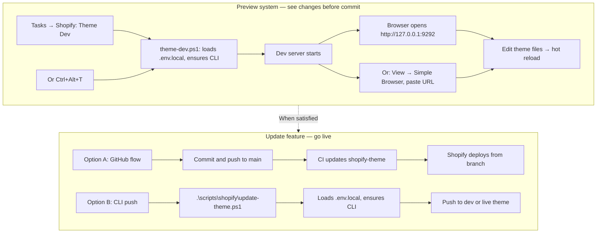
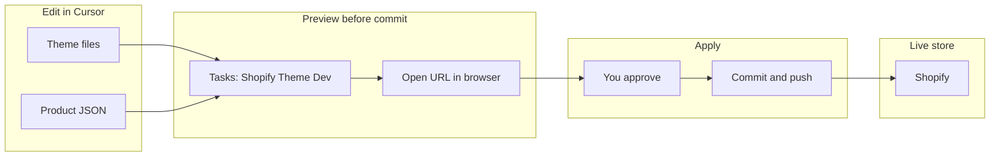
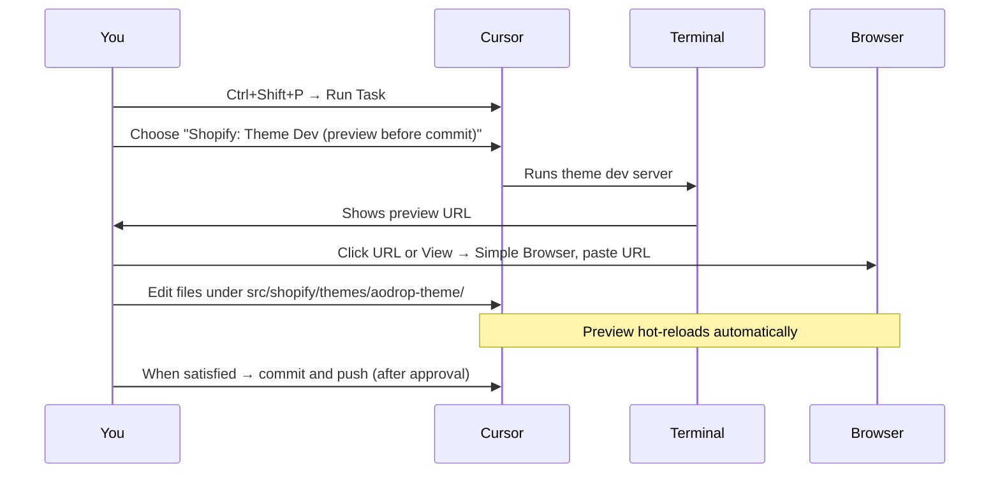
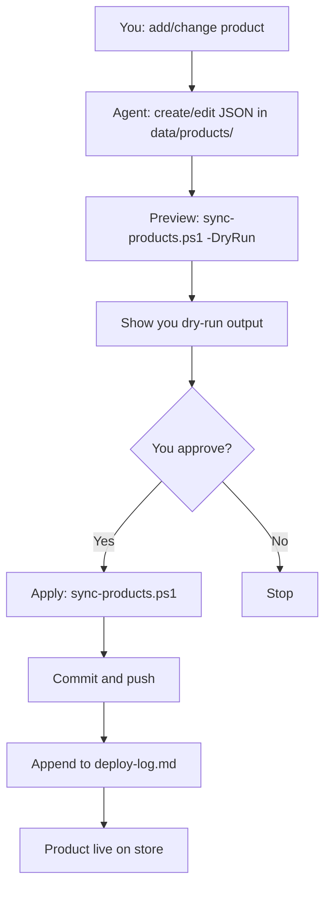
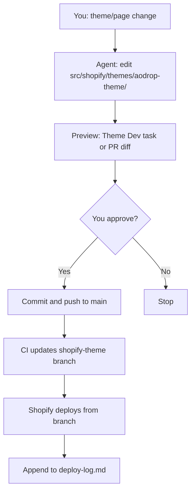
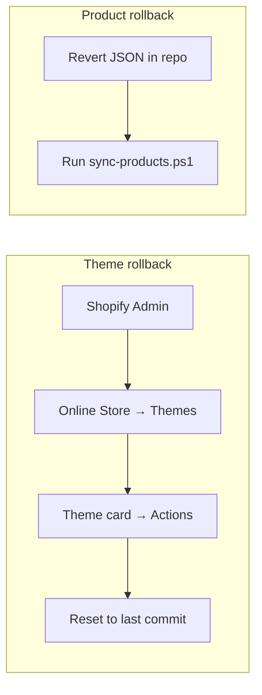
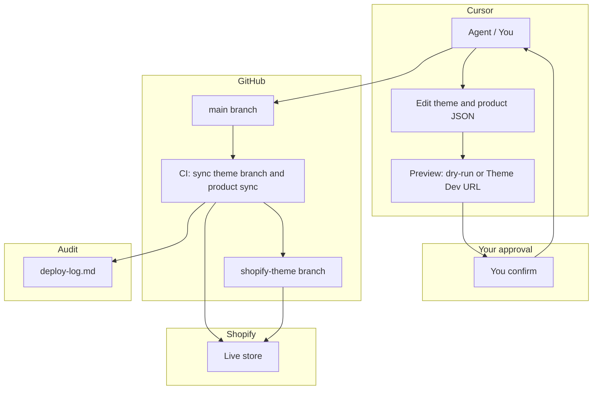

# Cursor → GitHub → Shopify: Visual Usage Guide

**Against The Odds (AO) store** — Edit in Cursor, preview live, push to GitHub, store updates. **New system (2026):** All tasks run from **repo root**; every store change uses **preview → snapshot to `docs/status/pending-approval.md` → you approve → apply → append to `docs/status/deploy-log.md`**. Products: JSON path (bulk) or browser path (one-off with uploads). No headless Admin automation; API or your browser only. See [docs/AGENT_WORKFLOW_CURSOR_SHOPIFY.md](../AGENT_WORKFLOW_CURSOR_SHOPIFY.md) and [OPERATOR_RUNBOOK.md](../../OPERATOR_RUNBOOK.md).

---

## System readiness (what runs automatically)

| Check                | What happens                                                                                                                                                                         |
| -------------------- | ------------------------------------------------------------------------------------------------------------------------------------------------------------------------------------ |
| **Shopify CLI**      | If missing, `theme-pull` / `theme-dev` / `update-theme` **install it automatically** (`npm install -g @shopify/cli @shopify/theme`). No manual install needed.                       |
| **Store / theme ID** | Scripts **load `.env.local`** from repo root when present. Set `SHOPIFY_STORE_DOMAIN` (e.g. `aodrop.com`) and optionally `SHOPIFY_THEME_ID` there so you don’t pass them every time. |
| **One-time auth**    | Run `shopify auth login` once (select store). Required for theme pull and local preview.                                                                                             |
| **Theme folder**     | If `src/shopify/themes/aodrop-theme` is empty, run `.\scripts\shopify\theme-pull.ps1` once from repo root (CLI installs if needed; store from `.env.local`).                         |

---

## Preview system vs Update feature

- **Preview:** Run from repo root. No commit required; browser (or Simple Browser) shows live theme. CLI and store are resolved automatically.
- **Update:** After approval, either **commit and push** (GitHub → store) or run **`update-theme.ps1`** for direct CLI push.

---

## At a glance

---

## 1. Preview your theme before committing (see work live)

**Goal:** See Shopify theme changes in the browser without committing. Run the task from **repo root** so script paths resolve.

**Seamless:** Press **Ctrl+Alt+T** (after adding the keybinding once — see `docs/KEYBINDING_PENDING_APPROVAL.md`) to start the theme dev server; your browser opens the preview URL automatically when the server is ready.

| Step | Action                                                                                   |
| ---- | ---------------------------------------------------------------------------------------- |
| 1    | In Cursor: **Ctrl+Shift+P** (Mac: **Cmd+Shift+P**) → type **Run Task**                   |
| 2    | Select **Shopify: Theme Dev (preview before commit)**                                    |
| 3    | Wait for the preview URL in the terminal (e.g. `https://...` or `http://127.0.0.1:9292`) |
| 4    | **Click the URL** in the terminal, or **View → Simple Browser** and paste the URL        |
| 5    | Edit theme files; the preview updates live. No commit needed to preview.                 |

**One-time:** If the theme folder is empty, run `.\scripts\shopify\theme-pull.ps1` from repo root. The script installs Shopify CLI if missing and reads `SHOPIFY_STORE_DOMAIN` from `.env.local`; you only need to run `shopify auth login` once.

---

## 2. Product listing flow (add or change a product)

**Goal:** Add or update a product on the store from Cursor.

| Step | Action                                                                                                                                                  |
| ---- | ------------------------------------------------------------------------------------------------------------------------------------------------------- |
| 1    | Ask in Cursor (e.g. "list this product on my page")                                                                                                     |
| 2    | Agent creates/edits JSON in `data/products/` (see `data/products/example-hoodie.json`)                                                                  |
| 3    | **Preview:** Agent runs `.\scripts\shopify\sync-products.ps1 -DryRun` and shows output                                                                  |
| 4    | **Snapshot:** Agent writes summary + dry-run output to `docs/status/pending-approval.md`. You open it via **Tasks → Open pending approval** or in chat. |
| 5    | **Approve:** You confirm in chat (e.g. "yes", "approve")                                                                                                |
| 6    | **Apply:** Agent runs sync without `-DryRun`, commit and push; clears pending-approval                                                                  |
| 7    | **Log:** Agent appends entry to `docs/status/deploy-log.md` (timestamp, summary, rollback)                                                              |

**Product with uploads from your PC:** Agent can use **JSON path** (bulk: add image URLs to product JSON after you upload to Shopify/CDN, then dry-run → approve → sync) or **browser path** (one-off: agent uses your browser via Cursor MCP to add product in Admin and attach your files; you approve before Save). See AGENT_WORKFLOW_CURSOR_SHOPIFY.md.

---

## 3. Theme / page flow (change store pages)

**Goal:** Change theme or pages; preview, then go live.

| Step | Action                                                                                                                             |
| ---- | ---------------------------------------------------------------------------------------------------------------------------------- |
| 1    | Ask in Cursor for theme or page changes                                                                                            |
| 2    | Agent edits files under `src/shopify/themes/aodrop-theme/`                                                                         |
| 3    | **Preview:** Run **Tasks → Shopify: Theme Dev** (from repo root), open URL or review diff                                          |
| 4    | **Snapshot:** Agent writes summary + URL/diff to `docs/status/pending-approval.md`; you open via **Tasks → Open pending approval** |
| 5    | **Approve:** You confirm in chat                                                                                                   |
| 6    | **Apply:** Commit and push to `main`; CI updates `shopify-theme`; Shopify deploys                                                  |
| 7    | **Log:** Append to `docs/status/deploy-log.md` (timestamp, summary, rollback)                                                      |

---

## 4. Rollback

| What         | How                                                                                                                                           |
| ------------ | --------------------------------------------------------------------------------------------------------------------------------------------- |
| **Theme**    | Shopify Admin → Online Store → Themes → on theme card → **Actions** → **Reset to last commit**. Or revert commit on `shopify-theme` and push. |
| **Products** | Revert `data/products/*.json` in repo and run `.\scripts\shopify\sync-products.ps1`; or fix in Shopify Admin.                                 |

---

## 5. Quick reference

| Goal                              | Command or action                                                                                                                                       |
| --------------------------------- | ------------------------------------------------------------------------------------------------------------------------------------------------------- |
| **Theme preview (before commit)** | **Tasks** → **Shopify: Theme Dev** or **Ctrl+Alt+T**. CLI auto-installs if missing; `.env.local` loaded. Open URL in terminal or View → Simple Browser. |
| **Theme update (go live)**        | **GitHub:** Commit and push to `main`. **CLI:** `.\scripts\shopify\update-theme.ps1` (loads `.env.local`, ensures CLI).                                 |
| Pull theme into repo              | `.\scripts\shopify\theme-pull.ps1` (CLI auto-install, `.env.local` for store)                                                                           |
| Product sync (preview)            | `.\scripts\shopify\sync-products.ps1 -DryRun`                                                                                                           |
| Product sync (apply)              | `.\scripts\shopify\sync-products.ps1`                                                                                                                   |
| Theme dev (terminal)              | `.\scripts\shopify\theme-dev.ps1`                                                                                                                       |
| Theme push (apply)                | `.\scripts\shopify\update-theme.ps1`                                                                                                                    |
| **Open pending approval**         | **Ctrl+Alt+P** (add keybinding once — see `docs/KEYBINDING_PENDING_APPROVAL.md`) or **Tasks** → **Open pending approval**. Opens in same window.        |
| **Theme preview (dev server)**    | **Ctrl+Alt+T** (add keybinding once) or **Tasks** → **Shopify: Theme Dev**. Browser opens preview URL automatically.                                    |
| Pending snapshot                  | `docs/status/pending-approval.md`                                                                                                                       |
| Deploy log                        | `docs/status/deploy-log.md`                                                                                                                             |
| Pipeline verification             | `npm run verify:pipeline` or `.\scripts\verify-pipeline.ps1`                                                                                            |

---

## 6. Full pipeline (end-to-end)

---

_Reference: [docs/AGENT_WORKFLOW_CURSOR_SHOPIFY.md](../AGENT_WORKFLOW_CURSOR_SHOPIFY.md), [docs/UPDATE_SHOPIFY_FROM_CURSOR.md](../UPDATE_SHOPIFY_FROM_CURSOR.md), [.cursor/plans/FINAL_REPO_ORGANIZATION_AND_AUDIT.plan.md](../../.cursor/plans/FINAL_REPO_ORGANIZATION_AND_AUDIT.plan.md). Last updated: 2026-02-01._
