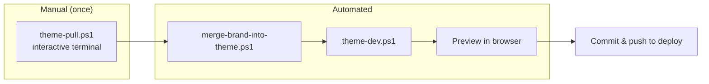

# AO Theme Customization — Flow & Visualized Preview

This document describes the **automated flow** for pulling the live theme, applying AO brand customization, and opening a **visualized preview**. Run the flow once manually (or in an interactive terminal for pull), then use the script for repeat runs.

---

## Flow diagram



**Steps:**

| Step               | Script / action                                                      | What it does                                                                                                                                                                   |
| ------------------ | -------------------------------------------------------------------- | ------------------------------------------------------------------------------------------------------------------------------------------------------------------------------ |
| 1. **Pull**        | `.\scripts\shopify\theme-pull.ps1` (run in **interactive** terminal) | Pulls live theme from aodrop.com into `src/shopify/themes/aodrop-theme/`. Requires `shopify auth login` once.                                                                  |
| 2. **Merge brand** | `.\scripts\shopify\merge-brand-into-theme.ps1`                       | Copies `ao-brand.css` and `ao-hero-brand.liquid` into theme; patches `layout/theme.liquid` (stylesheet + body class) when present.                                             |
| 3. **Preview**     | `.\scripts\shopify\theme-dev.ps1`                                    | Starts local theme dev server; open the URL (e.g. http://127.0.0.1:9292) to **see the AO brand theme** (dark background, accent colors, logo/slogan when assets are uploaded). |
| 4. **Deploy**      | Commit and push to connected branch                                  | Shopify deploys from repo.                                                                                                                                                     |

---

## One-command flow (after first pull)

After you have pulled the theme at least once (interactively):

```powershell
.\scripts\shopify\theme-pull-and-preview.ps1
```

- **Skip pull this run:** `.\scripts\shopify\theme-pull-and-preview.ps1 -SkipPull`
- **Only start preview (no pull, no merge):** `.\scripts\shopify\theme-pull-and-preview.ps1 -PreviewOnly`

If pull fails (e.g. non-interactive), run `theme-pull.ps1` manually in a terminal, then:

```powershell
.\scripts\shopify\merge-brand-into-theme.ps1
.\scripts\shopify\theme-dev.ps1
```

---

## Visualized preview — what you’ll see

When you open the **theme dev URL** (step 3), you get a **live preview** of the store with:

- **Dark background** (`#0d0d0d`) and cream text (`#f5f0e8`)
- **AO accent colors** (cyan, yellow, pink, violet) on buttons and links
- **Bold display typography** for headings
- **Logo/slogan/motto** where you’ve added the hero snippet and uploaded assets (see ASSETS_MANIFEST)

To **preview the look locally without Shopify**, open:

**`docs/guides/theme-preview-mock.html`** in your browser. It shows a static mock of the AO brand (dark theme, placeholder logo/slogan text, accent underlines) so you can see the style before running theme dev.

---

## Reference

- Brand spec: `docs/status/BRAND_THEME_CUSTOMIZATION_20260201.md`
- Apply instructions: `src/shopify/themes/ao-brand-customization/APPLY_INSTRUCTIONS.md`
- Asset placement: `src/shopify/themes/ao-brand-customization/ASSETS_MANIFEST.md`
- Layout steps (manual fallback): `src/shopify/themes/aodrop-theme/LAYOUT_STEPS.md`
