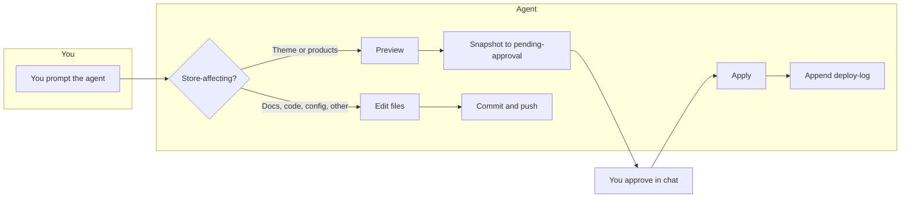
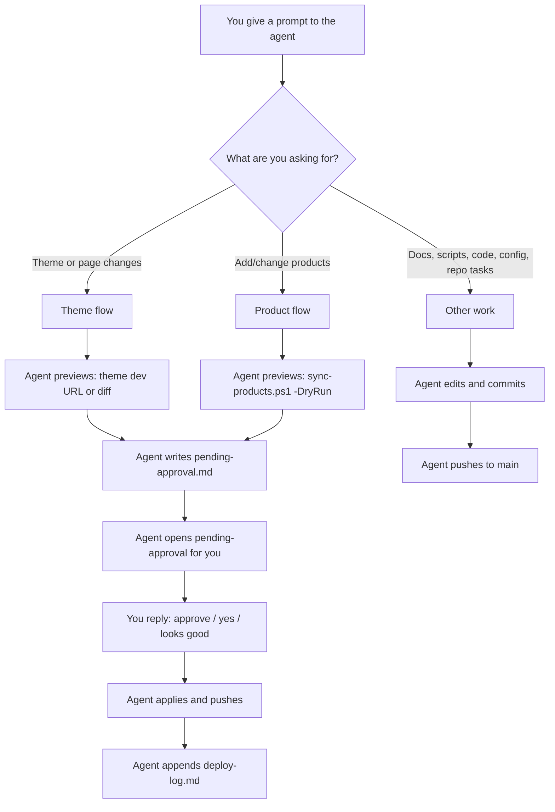
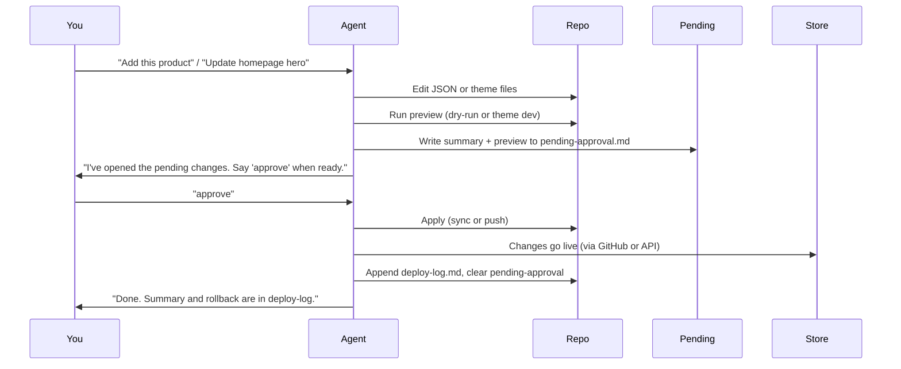
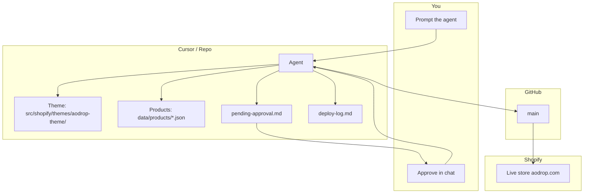

# Workflow & pipeline visual guide

**For you (the user)** — When you prompt a Cursor agent to change your Shopify store, theme, or any other project work, this guide shows how the system behaves and what to expect.

---

## At a glance: two paths

- **Store-affecting** (theme, products): Agent **previews** → writes **pending-approval** → you say **"approve"** in chat → agent **applies** → agent **logs** to deploy-log.
- **Other work** (docs, scripts, code, config): Agent **edits** → **commits and pushes**. No approval step.

---

## Decision: “What did I ask for?”

---

## Store path (theme + products) — step by step

Every **store-affecting** change follows the same pattern. The agent will not push to the live store until you approve.

| Step | What the agent does                                                                                                                                     | What you do                                   |
| ---- | ------------------------------------------------------------------------------------------------------------------------------------------------------- | --------------------------------------------- |
| 1    | Edits `data/products/*.json` or `src/shopify/themes/aodrop-theme/`                                                                                      | —                                             |
| 2    | Runs preview (product: `sync-products.ps1 -DryRun`; theme: theme dev URL or diff)                                                                       | —                                             |
| 3    | Writes [docs/status/pending-approval.md](../status/pending-approval.md) and runs `open-pending-approval.ps1` (and for theme: `start-theme-preview.ps1`) | Open the file / look at preview in browser    |
| 4    | Waits for your reply in chat                                                                                                                            | Reply **"approve"** (or "yes" / "looks good") |
| 5    | Applies (runs sync or pushes to main), then appends [docs/status/deploy-log.md](../status/deploy-log.md)                                                | —                                             |

**Theme preview shortcut (approved):** Press **Ctrl+Alt+T** to start the theme dev server; your browser opens the preview URL automatically. Keybindings are in your Cursor settings; on another machine, add once per [docs/KEYBINDING_PENDING_APPROVAL.md](../KEYBINDING_PENDING_APPROVAL.md). Run from repo root.

---

## Other work path (no store change)

For **docs, scripts, code, config, branch hygiene, or any task that does not change the live store**, the agent will:

1. Make the edits.
2. Commit and push to `main` (or the branch you’re on).

There is **no** pending-approval step or deploy-log entry unless you explicitly ask for a store change later.

---

## Where things live

| What                                         | Where                                                                                                                                                    |
| -------------------------------------------- | -------------------------------------------------------------------------------------------------------------------------------------------------------- |
| **Preview of what will change**              | [docs/status/pending-approval.md](../status/pending-approval.md) — agent fills this before asking you to approve                                         |
| **Theme preview shortcut**                   | **Ctrl+Alt+T** — start theme dev; browser opens preview URL (approved; in Cursor settings; see [KEYBINDING_PENDING_APPROVAL.md](../KEYBINDING_PENDING_APPROVAL.md) to add on another machine) |
| **History of store changes and rollback**    | [docs/status/deploy-log.md](../status/deploy-log.md) — agent appends after each apply                                                                    |
| **Full store workflow (agent instructions)** | [docs/AGENT_WORKFLOW_CURSOR_SHOPIFY.md](../AGENT_WORKFLOW_CURSOR_SHOPIFY.md)                                                                             |
| **Daily checks, credentials, theme dev**     | [OPERATOR_RUNBOOK.md](../../OPERATOR_RUNBOOK.md)                                                                                                         |
| **Theme source**                             | `src/shopify/themes/aodrop-theme/`                                                                                                                       |
| **Product data (sync to store)**             | `data/products/*.json`                                                                                                                                   |
| **Scripts (sync, theme dev, runbook)**       | `scripts/` — see [scripts/README.md](../../scripts/README.md)                                                                                            |

---

## Quick reference: “I want to …”

| You want to …                         | Agent will …                                                                              | You …                                                                                                                                                                                                                           |
| ------------------------------------- | ----------------------------------------------------------------------------------------- | ------------------------------------------------------------------------------------------------------------------------------------------------------------------------------------------------------------------------------- |
| Add or change a product               | Edit JSON, run `sync-products.ps1 -DryRun`, write pending-approval, wait for you          | Say **approve** in chat after checking the preview                                                                                                                                                                              |
| Change theme / homepage / section     | Edit theme files, show theme dev URL or diff, write pending-approval, start theme preview | Say **approve** in chat after checking the preview. **Shortcut:** **Ctrl+Alt+T** starts theme dev and opens preview in browser (in Cursor settings; see [KEYBINDING_PENDING_APPROVAL.md](../KEYBINDING_PENDING_APPROVAL.md) to add on another machine). |
| Add one product with images (one-off) | Use your browser (Shopify Admin), fill form, stop before Save                             | Say **approve** in chat, then agent or you clicks Save                                                                                                                                                                          |
| Update docs, scripts, or code         | Edit and commit/push                                                                      | No approval step; agent pushes when done                                                                                                                                                                                        |
| Run daily checks or verify setup      | Run lint, format, tests, or `run-runbook.ps1`                                             | No approval step                                                                                                                                                                                                                |

---

## End-to-end pipeline (full system)

- **Theme**: Push to `main` → GitHub (and Shopify GitHub App) → store.
- **Products**: Agent runs `sync-products.ps1` (after approval) → Admin API → store.
- **Audit**: Every store change is recorded in `deploy-log.md` with rollback steps.

---

## Rollback (if something goes wrong)

| Change type  | Rollback                                                                                                                              |
| ------------ | ------------------------------------------------------------------------------------------------------------------------------------- |
| **Theme**    | Shopify Admin → Online Store → Themes → theme card → **Actions** → **Reset to last commit**. Or revert the commit on `main` and push. |
| **Products** | Revert the JSON file(s) in the repo and run `.\scripts\shopify\sync-products.ps1` again; or edit/delete in Shopify Admin → Products.  |

Rollback steps for each change are also written in [docs/status/deploy-log.md](../status/deploy-log.md).

---

_See also: [AGENT_WORKFLOW_CURSOR_SHOPIFY.md](../AGENT_WORKFLOW_CURSOR_SHOPIFY.md) (agent steps), [SHOPIFY_CURSOR_USAGE_GUIDE.md](SHOPIFY_CURSOR_USAGE_GUIDE.md) (theme preview and tasks), [OPERATOR_RUNBOOK.md](../../OPERATOR_RUNBOOK.md) (daily ops and credentials)._
